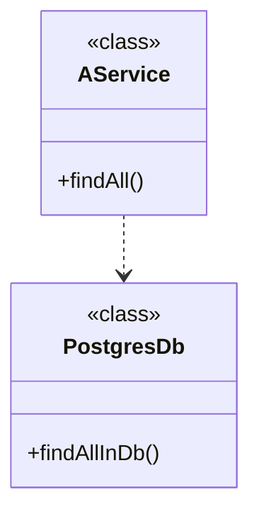
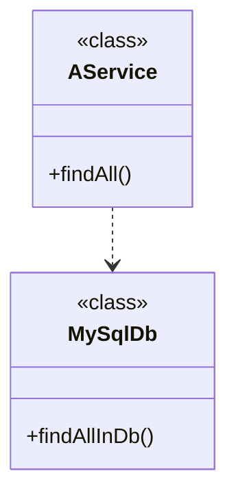
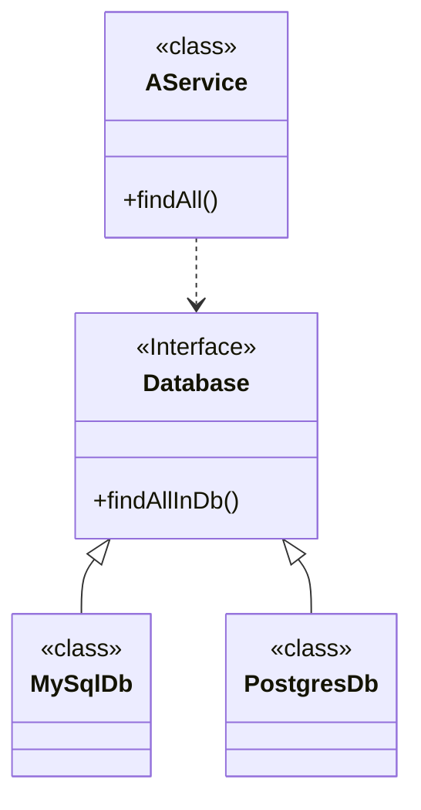
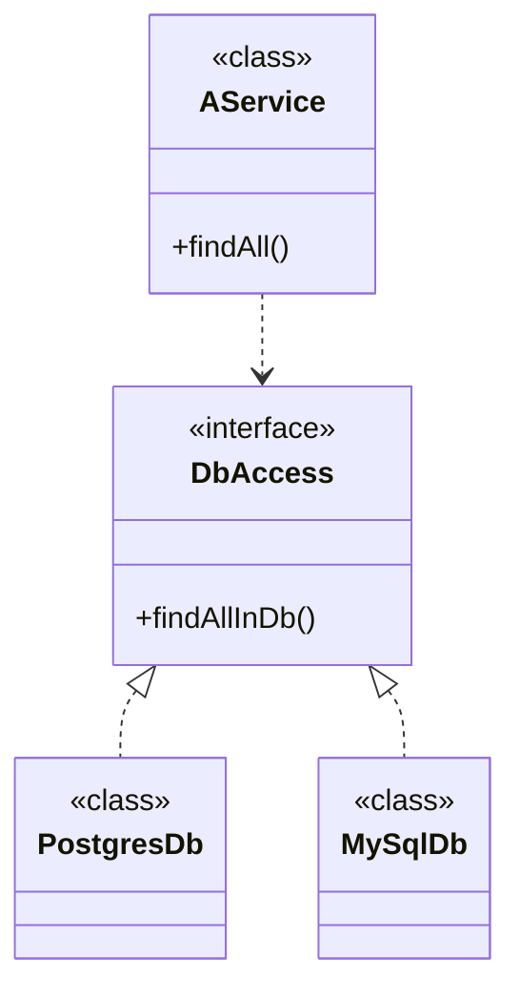

---
layout: TwoColumns
class: text-left
transition: fade
---

::left::



::right::

```kotlin
class AService() {
    val db = PostgresDb()

    fun findAll() = db.findAllInDb()
}
```

---
layout: TwoColumns
class: text-left
transition: fade
---

::left::



::right::

```kotlin
class AService() {
    val db = MySqlDb()

    fun findAll() = db.findAllInDb()
}
```

<!--

Exemple d'application simple,
un service doit appeler un autre service de base de donnée
-->

---
layout: TwoColumns
class: text-left
transition: fade
---

::left::



::right::

````md magic-move
```kotlin
class AService(val db: Database) {
  fun findAll() = db.findAllInDb()
}

interface Database {
  fun findAllInDb(): List<All>
}
```

```kotlin
class AService(val db: Database) {
  fun findAll() = db.findAllInDb()
}

interface Database {
  fun findAllInDb(): List<All>
}

class PostgresDb: Database {
  override fun findAllInDb() = TODO()
}
```

```kotlin
class AService(val db: Database) {
  fun findAll() = db.findAllInDb()
}

interface Database {
  fun findAllInDb(): List<All>
}

class PostgresDb: Database {
  override fun findAllInDb() = TODO()
}

class MySqlDb: Database {
  override fun findAllInDb() = TODO()
}
```
````

<!--

Avec deux implémentations de la base de donnée ça donne ça
-->

---
layout: two-cols
class: text-left
transition: fade
---



::right::

````md magic-move

```kotlin
class AService(val db: DbAccess) {
  fun findAll() = db.findAllInDb()
}

interface DbAccess {
  fun findAll() : List<Something>
}

```

```kotlin
class AService(val db: DbAccess) {
  fun findAll() = db.findAllInDb()
}

interface DbAccess {
  fun findAll() : List<Something>
}

class PostgresDb(): DbAccess {
  override fun findAll() = TODO()
}

class MySqlDb(): DbAccess{
  override fun findAll() = TODO()
}
```
````

<!--

On peut extraire une interface pour n'utiliser qu'une implémentation à la fois
-->

---
class: text-left
---

# Injection de dépendances

<div v-click>

```kotlin
val appPg = AService(PostgresDb())
```

</div>

<div v-click>

```kotlin
val appMy = AService(MySqlDb())
```

</div>

<!--

On peut donc faire plusieurs versions de notre application avec soit l'une soit l'autre
-->

---
layout: cover
---

# Spring DI

## Les Beans

---
layout: full
class: text-left
---

# Beans

````md magic-move

```kotlin
class MyConfig {


}
```

```kotlin
class MyConfig {

    fun myDb() = PostgresDb()


}
```

```kotlin
class MyConfig {

    fun myDb() = PostgresDb()


    fun aService() = AService(myDb())


}
```

```kotlin
class MyConfig {

    fun myDb() = PostgresDb()


    fun aService() = AService(myDb())


    fun another() = Other(myDb())
}
```

```kotlin
@Configuration
class MyConfig {

    fun myDb() = PostgresDb()


    fun aService() = AService(myDb())


    fun another() = Other(myDb())
}
```

```kotlin
@Configuration
class MyConfig {
    @Bean
    fun myDb() = PostgresDb()

    @Bean
    fun aService() = AService(myDb())

    @Bean
    fun another() = Other(myDb())
}
```
````

<!--

@Configuration dit à spring que c'est une classe de configuration, il doit la parcourir et instancier tout les Beans

Ça remplace la configuration XML

@Bean explique à Spring qu'il va devoir gérer cette instance

On peut utiliser ce bean dans un autre service

Et dans un autre
-->

---
layout: full
class: text-left
---

# Proxy proxy proxy

````md magic-move
```kotlin
@Configuration
class MyConfig {
    @Bean
    fun myDb() = PostgresDb()
}
```
```kotlin
@Configuration
class MyConfig {
    @Bean
●   fun myDb() = PostgresDb()
}
```
````

<div v-click.at="2">
Stack du breakpoint

```txt
myDb:4, MyConfig (bzh.zomzog)
CGLIB$myDb$2:-1, MyConfig$$SpringCGLIB$$0 (bzh.zomzog)
Invoke-1, MyConfig$$SpringCGLIB$$FastClass$$1 (bzh.zomzog)
...
```

</div>

<!--

Si on met un breakpoint sur l'appel de methode à cette stack

Spring va en-capsuler chaque instance dans des proxy

CGLIB est un système de génération de code dynamique

Tout doit être ouvert à l'extension (open class)
-->

---
layout: two-cols
class: text-left
---

````md magic-move
```kotlin
@Configuration
class MyConfig {
    @Bean
    fun myDb() = PostgresDb()

    @Bean
    fun aService() = AService(myDb())

    @Bean
    fun another() = Other(myDb())
}
```
```kotlin
// /!\ pseudo code
class SpringProxyMyConfig(val base: MyConfig) {
    
    val myDb: PostgresDb? = null;
    fun myDb() = myDb ?: base.postgresDb()

    val aService: aService? = null;
    fun aService() = aService ?: base.aService(myDb())

    val another: another? = null;
    fun another() = another ?: base.Other(myDb())
}
```
````

::right::

````md magic-move
```kotlin
val myDb = PostgresDB()

val aService = AService(PostgresDB())

val another = Other(PostgresDB())
```

```kotlin
val myDb = PostgresDB()

val aService = AService(myDb)

val another = Other(myDb)
```
````

---
layout: cover
class: text-left
---

# Application Context

---
layout: full
class: text-left
---

# Application Context

````md magic-move
```kotlin
fun main() {
}
```
```kotlin
fun main() {
  val context: ApplicationContext = 
     AnnotationConfigApplicationContext(MyConfig::class.java)
}
```

```kotlin
fun main() {
  val context: ApplicationContext = 
     AnnotationConfigApplicationContext(MyConfig::class.java)
  val service = context.getBean(AService::class.java)

}
```

```kotlin
fun main() {
  val context: ApplicationContext = 
     AnnotationConfigApplicationContext(MyConfig::class.java)
  val service = context.getBean(AService::class.java)
  service.findAllInDb()
}
```

```kotlin
fun main() {
  val context: ApplicationContext = 
     AnnotationConfigApplicationContext(MyConfig::class.java)
  val service = context.getBean(AService::class.java)
  service.findAllInDb()
}

// /!\ pseudo code
class ApplicationContext {
  val beans = List<Bean>

  fun getBean(klass: Class<T>) : T
}
```
````

<!--

On va créer un context spring avec ce fichier de configuration

*Context* DI

Permet de récupérer dans le contexte des instances des beans
-->

---
layout: cover
---

# Scope

---
layout: full
class: text-left
---

````md magic-move
```kotlin
@Configuration
class MyConfig {
    @Bean
    fun myDb() = PostgresDb()

    @Bean
    fun aService() = AService(myDb())

    @Bean
    fun another() = Other(myDb())
}

fun main() {
  val context: ApplicationContext = AnnotationConfigApplicationContext(MyConfig::class.java)
  val service = context.getBean(AService::class.java)
  val another = context.getBean(Other::class.java)

  // aService.dbAccess == another.dbAccess ?
}
```

```kotlin
@Configuration
class MyConfig {
    @Bean
    fun myDb() = PostgresDb()

    @Bean
    fun aService() = AService(myDb())

    @Bean
    fun another() = Other(myDb())
}

fun main() {
  val context: ApplicationContext = AnnotationConfigApplicationContext(MyConfig::class.java)
  val service = context.getBean(AService::class.java)
  val another = context.getBean(Other::class.java)

  // aService.dbAccess == another.dbAccess  = true
}
```
```kotlin
@Configuration
class MyConfig {
    @Bean @Scope(BeanDefinition.SCOPE_SINGLETON)
    fun myDb() = PostgresDb()

    @Bean @Scope(BeanDefinition.SCOPE_SINGLETON)
    fun aService() = AService(myDb())

    @Bean @Scope(BeanDefinition.SCOPE_SINGLETON)
    fun another() = Other(myDb())
}

fun main() {
  val context: ApplicationContext = AnnotationConfigApplicationContext(MyConfig::class.java)
  val service = context.getBean(AService::class.java)
  val another = context.getBean(Other::class.java)

  // aService.dbAccess == another.dbAccess  = true
}
```
```kotlin
@Configuration
class MyConfig {
    @Bean @Scope(BeanDefinition.SCOPE_PROTOTYPE)
    fun myDb() = PostgresDb()

    @Bean @Scope(BeanDefinition.SCOPE_SINGLETON)
    fun aService() = AService(myDb())

    @Bean @Scope(BeanDefinition.SCOPE_SINGLETON)
    fun another() = Other(myDb())
}

fun main() {
  val context: ApplicationContext = AnnotationConfigApplicationContext(MyConfig::class.java)
  val service = context.getBean(AService::class.java)
  val another = context.getBean(Other::class.java)

  // aService.dbAccess == another.dbAccess  = false
}
```
````

<!--

Egalité de référence en SINGLETON

Pas en PROTOTYPE
-->

---
layout: full
class: text-left
---

# Scope

Singleton -> un unique bean

Prototype -> un bean par instance d'objet

<div v-click.at="2">

# Web-aware Scope

Request -> un bean pour la durée de vie de la requête HTTP

Session -> un bean pour la durée de la session HTTP

Application -> un bean pour la durée de vie de la servlet

WebSocket -> un bean pour la durée de vie de la WebSocket
</div>

---
layout: full
class: text-left
---

````md magic-move
```kotlin
@Configuration
class MyConfig {
    @Bean
    fun myDb() = PostgresDb()

    @Bean
    fun aService() = AService(myDb())

    @Bean
    fun another() = Other(myDb())
}
```

```kotlin
@Configuration
class MyDatabaseConfig {
    @Bean
    fun myDb() = PostgresDb()
}

@Configuration
class MyConfig {
    @Bean
🚫  fun aService() = AService(myDb())

    @Bean
🚫  fun another() = Other(myDb())
}
```

```kotlin
@Configuration
class MyDatabaseConfig {
    @Bean
    fun myDb() = PostgresDb()
}

@Configuration
class MyConfig {
    @Bean
    fun aService(db: Database) = AService(db)

    @Bean
    fun another(db: Database) = Other(db)
}
```

```kotlin
@Configuration
class MyDatabaseConfig {
    @Bean
    fun myDb() = PostgresDb()
}

@Configuration
class MyConfig(val db: Database) {
    @Bean
    fun aService() = AService(db)

    @Bean
    fun another() = Other(db)
}
```
````

---
layout: cover
---

# Autowired

---
layout: TwoColumns
class: text-left
---

::left::

## Injection par constructeur

```kotlin
class AService(val db: Database) {


}

```

<div v-click.at=1>

```kotlin
@Configuration
class MyConfig {
    @Bean
    fun myDb() = PostgresDb()

    @Bean
    fun aService() = AService(myDb())
}
```

</div>

::right::

<div v-click.at=2>

## Injection par propriété

```kotlin
class AService {
    @Autowired
    lateinit var database: DbAccess
}
```

</div>

<div v-click.at=3>

```kotlin
@Configuration
class MyConfig {
    @Bean
    fun myDb() = PostgresDb()

    @Bean
    fun aService() = AService()
}
```

</div>

---
layout: cover
---

# Stereotype

---
layout: full
class: text-left
---

````md magic-move

```kotlin
@Configuration
class MyConfig {
    @Bean
    fun myDb() = PostgresDb()

    @Bean
    fun aService() = AService()
}

class AService {
    @Autowired
    lateinit var database: Database
}
```

```kotlin
@Configuration
class MyConfig {
    @Bean
    fun myDb() = PostgresDb()

    //@Bean
    //fun aService() = AService()
}

@Service
class AService {
    @Autowired
    lateinit var database: Database
}
```

```kotlin
@Configuration
class MyConfig {
    @Bean
    fun myDb() = PostgresDb()

    //@Bean
    //fun aService() = AService()
}

@Service
class AService(val database: Database) {
}
```
````

<!--

ComponentScan va forcer spring à chercher tous les stereotypes du package

Service demande la création d'un bean de cette classe
-->

---
layout: full
class: text-left
---

# Stereotype

## @Component
Déclare que la classe doit devenir un bean lors du scan

## 3 alias pour le DDD

@Controller

@Service

@Repository

<!--

Les 4 sont équivalent,
ils sont plus sémantique pour de la documentation
-->

---
layout: full
class: text-left
---

# Stereotype

## @Configuration ?

```java
@Target(ElementType.TYPE)
@Retention(RetentionPolicy.RUNTIME)
@Documented
@Component
public @interface Configuration {
}
```

@Configuration est une extension de component, mais a son propre cycle de vie

@Configuration crée quand même un bean

---
layout: full
class: text-left
---

````md magic-move

```kotlin
fun main() {
  val context: ApplicationContext = 
     AnnotationConfigApplicationContext(MyConfig::class.java)
  val service = context.getBean(AService::class.java)
  service.findAllInDb()
}

// /!\ pseudo code
class ApplicationContext {
  val beans = List<Bean>

  fun getBean(klass: Class<T>) : T
}
```
```kotlin
@Configuration
class MyConfig {
    @Bean
    fun myDb() = PostgresDb()

    @Bean
    fun aService(db: Database) = AService(db)
}
```
```kotlin
@Configuration
class MyConfig {
    @Bean
    fun myDb() = PostgresDb()

    @Bean
    fun my2ndDb() = PostgresDb()

    @Bean
🚫  fun aService(db: Database) = AService(db) // deux bean db
}
```
```kotlin
@Configuration
class MyConfig {
    @Bean
    @Primary
    fun myDb() = PostgresDb()

    @Bean
    fun my2ndDb() = PostgresDb()

    @Bean
    fun aService(db: Database) = AService(db) // myDb
}
```
```kotlin
@Configuration
class MyConfig {
    @Bean
    @Primary
    fun myDb() = PostgresDb()

    @Bean
    fun my2ndDb() = PostgresDb()

    @Bean
    fun aService(@Qualifier("my2ndDb") db: Database) = AService(db) //  my2ndDb
}
```
```kotlin
@Configuration
class MyConfig {
    @Bean
    @Primary
    fun myDb() = PostgresDb()

    @Bean("secondary")
    fun my2ndDb() = PostgresDb()

    @Bean
    fun aService(@Qualifier("secondary") db: Database) = AService(db) //  my2ndDb
}
```
````

---
layout: cover
class: text-left
---

# TL;DR

---
layout: full
class: text-left
---

# Bean creation avec @Bean

```kotlin
@Configuration
class MyDatabaseConfig() {
    @Bean
    fun myDb() = PostgresDb()
}
```

# Bean creation avec Stereotype

```kotlin
@Service
class MyService() {
}

@Component
class MyOtherService() {
}
```

---
layout: full
class: text-left
---

## @Configuration

### Injection de dépendances appel direct

```kotlin
@Configuration
class MyDatabaseConfig() {
    @Bean
    fun myDb() = PostgresDb()

    @Bean
    fun myService() = MyService(myDb())
}
```

### Injection de dépendances par paramètre

```kotlin
@Configuration
class MyDatabaseConfig() {
    @Bean
    fun myService(db: Database) = MyService(db)
}
```

### Injection de dépendances par constructeur

```kotlin
@Configuration
class MyDatabaseConfig(val db: Database) {
    @Bean
    fun myService() = MyService(db)
}
```

---
layout: full
class: text-left
---

## @Component

### Injection de dépendances par constructeur

```kotlin
@Service
class MyService(val db: Database) {
}
```

### Injection de dépendances par autowired

```kotlin
@Service
class MyService {
    @Autowired
    lateinit var db: Database
}
```

---
layout: full
class: text-left
---

## @Scope

### @Bean @Scope

```kotlin
@Configuration
class MyConfig {
    @Bean @Scope(BeanDefinition.SCOPE_SINGLETON)
    fun onlyOneForAll() = PostgresDb()

    @Bean @Scope(BeanDefinition.SCOPE_PROTOTYPE)
    fun oneBeanPerCall() = PostgresDb()
}
```

### @Bean @Scope

```kotlin
@Service
@Scope(BeanDefinition.SCOPE_SINGLETON)
class MyService {
    @Autowired
    lateinit var db: Database
}
```

---
layout: full
class: text-left
---

## Résolution de conflit

### @Primary

```kotlin
@Configuration
class MyConfig {
    @Bean
    @Primary
    fun myDb() = PostgresDb()

    @Bean("secondary")
    fun my2ndDb() = PostgresDb()

    @Bean
    fun aService(@Qualifier("secondary") db: Database) = AService(db) //  my2ndDb
}
```

### @Qualifier

```kotlin
@Configuration
class MyConfig {

    @Bean
    fun aService(@Qualifier("secondary") db: Database) = AService(db) //  my2ndDb
}
```

---
layout: full
class: text-left
---

## Résolution de conflit

### Noms des beans

```kotlin
@Configuration
class MyConfig {

    @Bean
    fun nomDuBean() = PostgresDb()

    @Bean("nouveauNomDuBean")
    fun nomDuBean() = PostgresDb()
}
```

```kotlin
@Service("unAutreNom")
class MyService {
}
```
