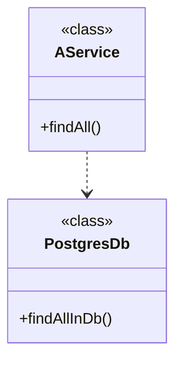
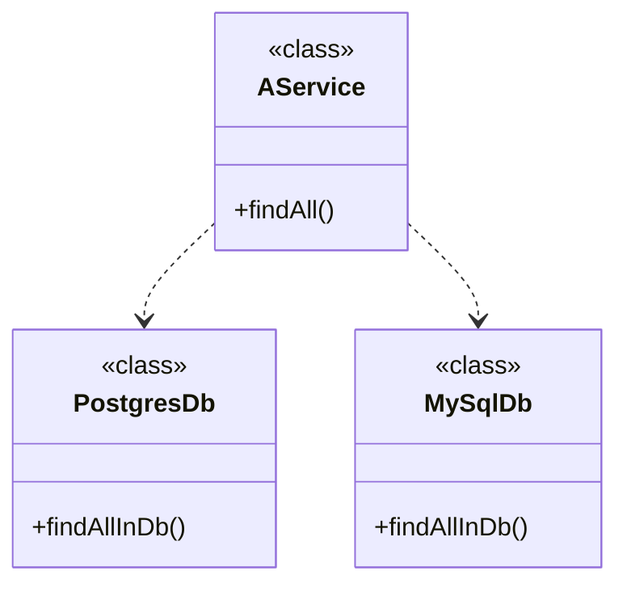
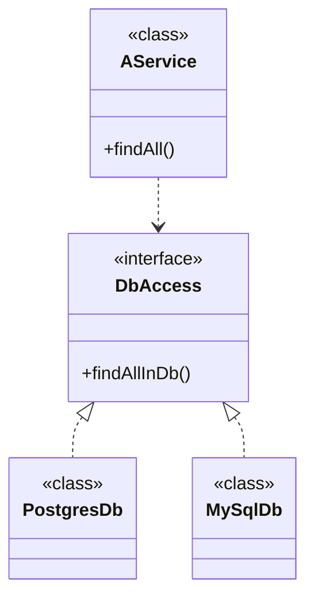

---
layout: TwoColumns
class: text-left
---

::title::

# Injection de dépendances

::left::



::right::

```kotlin {*}{class:'!children:text-xl'}
class AService() {
    val db = PostgresDb()

    fun findAll() = db.findAllInDb()
}
```

<!--

Exemple d'application simple,
un service doit appeler un autre service de base de donnée
-->

---
layout: TwoColumns
class: text-left
---

::title::

# Injection de dépendances

::left::



::right::

```kotlin {*}{class:'!children:text-xl'}
class AService() {
  val pg = PostgresDb()
  val my = MySqlDb()

  fun findAll(pg: Boolean) = if(pg) {
    db.findAllInDb()
  } else {
    my.findAllInDb()
  }
}
```

<!--

Avec deux implémentations de la base de donnée ça donne ça
-->

---
layout: two-cols
class: text-left
---



::right::

````md magic-move

```kotlin {*}{class:'!children:text-xl'}
class AService(val db: DbAccess) {
  fun findAll() = db.findAllInDb()
}

interface DbAccess {
  fun findAll() : List<Something>
}

```

```kotlin {*}{class:'!children:text-xl'}
class AService(val db: DbAccess) {
  fun findAll() = db.findAllInDb()
}

interface DbAccess {
  fun findAll() : List<Something>
}

class PostgresDb(): DbAccess {
  override fun findAll() = TODO()
}

class MySqlDb(): DbAccess{
  override fun findAll() = TODO()
}
```
````

<!--

On peut extraire une interface pour n'utiliser qu'une implémentation à la fois
-->

---
class: text-left
---

# Injection de dépendances

<div v-click>

```kotlin {*}{class:'!children:text-xl'}
val appPg = AService(PostgresDb())
```

</div>

<div v-click>

```kotlin {*}{class:'!children:text-xl'}
val appMy = AService(MySqlDb())
```

</div>

<!--

On peut donc faire plusieurs versions de notre application avec soit l'une soit l'autre
-->

---
layout: full
class: text-left
---

# Beans

````md magic-move

```kotlin {*}{class:'!children:text-xl'}
@Configuration
class MyConfig {


}
```

```kotlin {*}{class:'!children:text-xl'}
@Configuration
class MyConfig {
    @Bean
    fun myDb() = PostgresDb()


}
```

```kotlin {*}{class:'!children:text-xl'}
@Configuration
class MyConfig {
    @Bean
    fun myDb() = PostgresDb()

    @Bean
    fun aService() = AService(myDb())


}
```

```kotlin {*}{class:'!children:text-xl'}
@Configuration
class MyConfig {
    @Bean
    fun myDb() = PostgresDb()

    @Bean
    fun aService() = AService(myDb())

    @Bean
    fun another() = Other(myDb())
}
```
````

<!--

@Configuration dit à spring que c'est une classe de configuration, il doit la parcourir et instancier tout les Beans

Ça remplace la configuration XML

@Bean explique à Spring qu'il va devoir gérer cette instance

On peut utiliser ce bean dans un autre service

Et dans un autre
-->

---
layout: two-cols
class: text-left
---

````md magic-move
```kotlin
@Configuration
class MyConfig {
    @Bean
    fun myDb() = PostgresDb()

    @Bean
    fun aService() = AService(myDb())

    @Bean
    fun another() = Other(myDb())
}
```
```kotlin
// /!\ pseudo code
class SpringProxyMyConfig(val base: MyConfig) {
    
    val myDb: PostgresDb? = null;
    fun myDb() = myDb ?: base.postgresDb()

    val aService: aService? = null;
    fun aService() = aService ?: base.aService(myDb())

    val another: another? = null;
    fun another() = another ?: base.Other(myDb())
}
```
````

::right::

````md magic-move
```kotlin
val myDb = PostgresDB()

val aService = AService(PostgresDB())

val another = Other(PostgresDB())
```

```kotlin
val myDb = PostgresDB()

val aService = AService(myDb)

val another = Other(myDb)
```
````

---
layout: full
class: text-left
---

# Application Context

````md magic-move
```kotlin
fun main() {
  val context: ApplicationContext = 
     AnnotationConfigApplicationContext(MyConfig::class.java)


}
```

```kotlin {*}{class:'!children:text-xl'}
fun main() {
  val context: ApplicationContext = 
     AnnotationConfigApplicationContext(MyConfig::class.java)
  val service = context.getBean(AService::class.java)

}
```

```kotlin {*}{class:'!children:text-xl'}
fun main() {
  val context: ApplicationContext = 
     AnnotationConfigApplicationContext(MyConfig::class.java)
  val service = context.getBean(AService::class.java)
  service.findAllInDb()
}
```

```kotlin {*}{class:'!children:text-xl'}
fun main() {
  val context: ApplicationContext = 
     AnnotationConfigApplicationContext(MyConfig::class.java)
  val service = context.getBean(AService::class.java)
  service.findAllInDb()
}

// /!\ pseudo code
class ApplicationContext {
  val beans = List<Bean>

  fun getBean(klass: Class<T>) : T
}
```
````

<!--

On va créer un context spring avec ce fichier de configuration

*Context* DI

Permet de récupérer dans le contexte des instances des beans
-->

---
layout: full
class: text-left
---

# Scope

````md magic-move
```kotlin
@Configuration
class MyConfig {
    @Bean
    fun myDb() = PostgresDb()

    @Bean
    fun aService() = AService(myDb())

    @Bean
    fun another() = Other(myDb())
}

fun main() {
  val context: ApplicationContext = AnnotationConfigApplicationContext(MyConfig::class.java)
  val service = context.getBean(AService::class.java)
  val another = context.getBean(Other::class.java)

  // aService.dbAccess == another.dbAccess
}

```
```kotlin {*}{class:'!children:text-xl'}
@Configuration
class MyConfig {
    @Bean @Scope(BeanDefinition.SCOPE_SINGLETON)
    fun myDb() = PostgresDb()

    @Bean @Scope(BeanDefinition.SCOPE_SINGLETON)
    fun aService() = AService(myDb())

    @Bean @Scope(BeanDefinition.SCOPE_SINGLETON)
    fun another() = Other(myDb())
}

fun main() {
  val context: ApplicationContext = AnnotationConfigApplicationContext(MyConfig::class.java)
  val service = context.getBean(AService::class.java)
  val another = context.getBean(Other::class.java)

  // aService.dbAccess == another.dbAccess
}
```
```kotlin {*}{class:'!children:text-xl'}
@Configuration
class MyConfig {
    @Bean @Scope(BeanDefinition.SCOPE_PROTOTYPE)
    fun myDb() = PostgresDb()

    @Bean @Scope(BeanDefinition.SCOPE_SINGLETON)
    fun aService() = AService(myDb())

    @Bean @Scope(BeanDefinition.SCOPE_SINGLETON)
    fun another() = Other(myDb())

fun main() {
  val context: ApplicationContext = AnnotationConfigApplicationContext(MyConfig::class.java)
  val service = context.getBean(AService::class.java)
  val another = context.getBean(Other::class.java)

  // aService.dbAccess != another.dbAccess
}
```
````

<!--

Egalité de référence en SINGLETON

Pas en PROTOTYPE
-->

---

# Scope

```kotlin {*}{class:'!children:text-xl'}
@Configuration
class MyConfig {
    @Bean @Scope(BeanDefinition.SCOPE_PROTOTYPE)
    fun myDb() = PostgresDb()

    @Bean @Scope(BeanDefinition.SCOPE_SINGLETON)
    fun aService() = AService(myDb())

    @Bean @Scope(BeanDefinition.SCOPE_SINGLETON)
    fun another() = Other(myDb())
}
```

aService.dbAccess != another.dbAccess

---

# Scope

Singleton -> un unique bean

Prototype -> un bean par instance d'objet

---

# Web-aware Scope

Request -> un bean pour la durée de vie de la requête HTTP

Session -> un bean pour la durée de la session HTTP

Application -> un bean pour la durée de vie de la servlet

WebSocket -> un bean pour la durée de vie de la WebSocket

---

# Proxy proxy proxy

```kotlin {*}{class:'!children:text-xl'}
@Configuration
class MyConfig {
    @Bean
●   fun myDb() = PostgresDb()
}
```

Stack du breakpoint
[source]

```
myDb:4, MyConfig (bzh.zomzog)
CGLIB$myDb$2:-1, MyConfig$$SpringCGLIB$$0 (bzh.zomzog)
Invoke-1, MyConfig$$SpringCGLIB$$FastClass$$1 (bzh.zomzog)
...
```

<!--

Si on met un breakpoint sur l'appel de methode à cette stack

Spring va en-capsuler chaque instance dans des proxy

CGLIB est un système de génération de code dynamique

Tout doit être ouvert à l'extension (open class)
-->

[transition#fade-out]
---

# Autowired

```kotlin {*}{class:'!children:text-xl'}
@Configuration
class MyConfig {
    @Bean
    fun myDb() = PostgresDb()

    @Bean
    fun aService() = AService(myDb())
}
```

```kotlin {*}{class:'!children:text-xl'}
class AService (

    val database: DBAccess
)
```

[transition#fade-out]
---

# Autowired

```kotlin {*}{class:'!children:text-xl'}
@Configuration
class MyConfig {
    @Bean
    fun myDb() = PostgresDb()

    @Bean
    fun aService() = AService()
}
```

```kotlin {*}{class:'!children:text-xl'}
class AService {

    lateinit var database: DbAccess
}
```

[transition#fade-out]
---

# Autowired

```kotlin {*}{class:'!children:text-xl'}
@Configuration
class MyConfig {
    @Bean
    fun myDb() = PostgresDb()

    @Bean
    fun aService() = AService()
}
```

```kotlin {*}{class:'!children:text-xl'}
class AService {
    @Autowired
    lateinit var database: DbAccess
}
```

[transition#fade-out]
---

# Stereotype

```kotlin {*}{class:'!children:text-xl'}
@Configuration
@ComponentScan("bzh.zomzog.iut.poc")
class MyConfig {
    @Bean
    fun myDb() = PostgresDb()

    //@Bean
    //fun aService() = AService()
}
```

```kotlin {*}{class:'!children:text-xl'}
@Service
class AService {
    @Autowired
    lateinit var database: DBAccess
}
```

<!--

ComponentScan va forcer spring à chercher tous les stereotypes du package

Service demande la création d'un bean de cette classe
-->

---

# Stereotype

@Component -> déclare que la classe doit devenir un bean lors du scan

3 alias:

@Controller

@Service

@Repository

<!--

Les 4 sont équivalent,
ils sont plus sémantique pour de la documentation
-->

---

# Stereotype - @Configuration

[source,java]

```
@Target(ElementType.TYPE)
@Retention(RetentionPolicy.RUNTIME)
@Documented
@Component
public @interface Configuration {
}
```

@Configuration est une extension de component, mais a son propre cycle de vie

@Configuration crée quand même un bean

---

# Depenency Injection

```kotlin {*}{class:'!children:text-xl'}
@Service
class AService {
    @Autowired
    lateinit var database: DBAccess
}
```

```kotlin {*}{class:'!children:text-xl'}
@Service
class AService(database: DBAccess) {
}
```

---

# Depenency Injection

```kotlin {*}{class:'!children:text-xl'}
@Configuration
class MyConfig {
    @Bean
    fun myDb() = PostgresDb()

    @Bean
    fun aService() = AService(myDb())
}
```

```kotlin {*}{class:'!children:text-xl'}
@Configuration
class MyConfig {
    @Bean
    fun myDb() = PostgresDb()

    @Bean
    fun aService(dbAccess: DBAccess) = AService(dbAccess)
}
```

[transition#fade-in]
---

# External Beans

```kotlin {*}{class:'!children:text-xl'}
@Configuration
class MyConfig {
    @Bean
    fun myDb(aDriverFromALib: JdbcDriver) = GenericDb(aDriverFromALib)

    @Bean
    fun aService() = AService(myDb())

    @Bean
    fun another() = Other(myDb())
}
```

---

# Beans limits

Le nom de chaque bean doit être unique

Si plusieurs beans correspondent à un autowired, la résolution doit être explicitée

Il ne faut pas de cycle pour leur création

---

# Noms

Par défaut, un bean a le nom de la méthode qui le crée

On peut le forcer `@Bean("monNom")`

---

# Conflit

@Primary sur un bean -> en cas de conflit, c'est lui qui est choisi

@Autowired @Qualifier("monNom") spécifie le bean attendu
