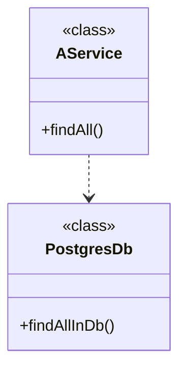
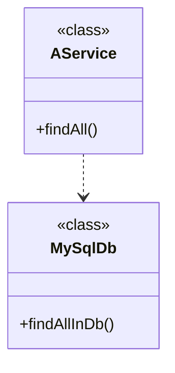
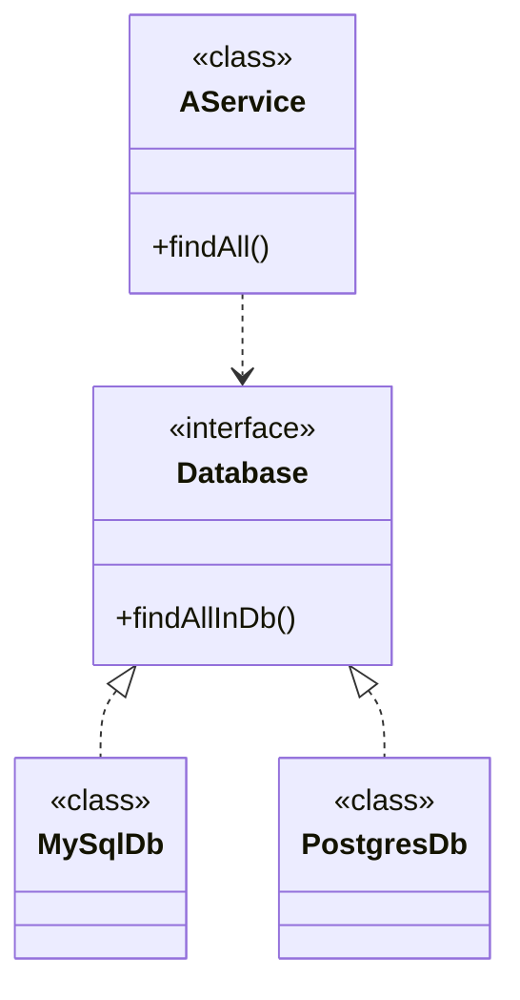

---
layout: TwoColumns
class: text-left
transition: fade
---

::left::

<div class="grid grid-cols-2 gap-8 h-full">
  <div class="w-full">


```mermaid
classDiagram
    direction TD
    class AService {
        <<class>>
        +findAll()
    }
    class PostgresDb {
        <<class>>
        +findAllInDb()
    }
    AService ..> PostgresDb
```

  </div>
  <div class="w-full" v-click.at="2">


```mermaid
---
  config:
    class:
      hideEmptyMembersBox: true
---
classDiagram
    direction TD
    class AService {
        <<class>>
        +findAll()
    }
    class MySqlDb {
        <<class>>
        +findAllInDb()
    }
    AService ..> MySqlDb
```

  </div>
</div>

::right::

<div v-click.at="1">

```kotlin
class AService() {
    val db = PostgresDb()

    fun findAll() = db.findAllInDb()
}
```

</div>

<div v-click.at="3">

```kotlin
class AService() {
    val db = MySqlDb()

    fun findAll() = db.findAllInDb()
}
```

</div>

<!--

Exemple d'application simple,
un service doit appeler un autre service de base de donnée
-->

---
layout: TwoColumns
class: text-left
transition: fade
---

::left::


```mermaid
classDiagram
    direction TD
    class AService {
        <<class>>
        +findAll()
    }
    class Database {
        <<interface>>
        +findAllInDb()
    }
    class MySqlDb {
        <<class>>
    }
    class PostgresDb {
        <<class>>
    }
    AService ..> Database
    Database <|.. MySqlDb
    Database <|.. PostgresDb
```

::right::

````md magic-move
```kotlin
class AService(val db: Database) {
  fun findAll() = db.findAllInDb()
}

interface Database {
  fun findAllInDb(): List<Pony>
}
```

```kotlin
class AService(val db: Database) {
  fun findAll() = db.findAllInDb()
}

interface Database {
  fun findAllInDb(): List<Pony>
}

class PostgresDb: Database {
  override fun findAllInDb() = TODO()
}
```

```kotlin
class AService(val db: Database) {
  fun findAll() = db.findAllInDb()
}

interface Database {
  fun findAllInDb(): List<Pony>
}

class PostgresDb: Database {
  override fun findAllInDb() = TODO()
}

class MySqlDb: Database {
  override fun findAllInDb() = TODO()
}
```
````

<div v-click>

```kotlin
val appPg = AService(PostgresDb())
```

</div>

<div v-click>

```kotlin
val appMy = AService(MySqlDb())
```

</div>

<!--

On extrait une interface `Database` : `AService` ne dépend plus d'une implémentation concrète.

[click] `PostgresDb` implémente l'interface

[click] `MySqlDb` aussi → on choisit l'une ou l'autre sans toucher `AService`

On peut donc faire plusieurs versions de notre application avec soit l'une soit l'autre
-->

---
layout: cover
---

# Spring DI

## Les Beans

---
layout: full
class: text-left
---

## Beans

````md magic-move

```kotlin
class MyConfig {


}
```

```kotlin
class MyConfig {

    fun myDb() = PostgresDb()


}
```

```kotlin
class MyConfig {

    fun myDb() = PostgresDb()


    fun aService() = AService(myDb())


}
```

```kotlin

class MyConfig {

    fun myDb() = PostgresDb()


    fun aService() = AService(myDb())


    fun another() = Other(myDb())
}
```

```kotlin
@Configuration
class MyConfig {

    fun myDb() = PostgresDb()


    fun aService() = AService(myDb())


    fun another() = Other(myDb())
}
```

```kotlin
@Configuration
class MyConfig {
    @Bean
    fun myDb() = PostgresDb()

    @Bean
    fun aService() = AService(myDb())

    @Bean
    fun another() = Other(myDb())
}
```
```kotlin
@Configuration
class MyConfig {
    @Bean
●   fun myDb() = PostgresDb()

    @Bean
    fun aService() = AService(myDb())

    @Bean
    fun another() = Other(myDb())
}
```
````

<div v-click.at="7">

## Proxy proxy proxy

Stack du breakpoint

```txt
myDb:4, MyConfig (bzh.zomzog)
CGLIB$myDb$2:-1, MyConfig$$SpringCGLIB$$0 (bzh.zomzog)
Invoke-1, MyConfig$$SpringCGLIB$$FastClass$$1 (bzh.zomzog)
...
```

</div>

<!--

@Configuration dit à spring que c'est une classe de configuration, il doit la parcourir et instancier tous les Beans

Ça remplace la configuration XML

@Bean explique à Spring qu'il va devoir gérer cette instance

On peut utiliser ce bean dans un autre service

Et dans un autre

## proxy

Si on met un breakpoint sur l'appel de methode à cette stack

Spring va encapsuler chaque instance dans des proxy

CGLIB est un système de génération de code dynamique

Tout doit être ouvert à l'extension (open class)
-->

---
layout: two-cols
class: text-left
---

````md magic-move
```kotlin
@Configuration
class MyConfig {
    @Bean
    fun myDb() = PostgresDb()

    @Bean
    fun aService() = AService(myDb())

    @Bean
    fun another() = Other(myDb())
}
```
```kotlin
// /!\ pseudo code
class SpringProxyMyConfig(val base: MyConfig) {
    
    var myDb: PostgresDb? = null
    fun myDb() = myDb ?: base.myDb().also { myDb = it }

    var aService: AService? = null
    fun aService() = aService ?: base.aService().also { aService = it }

    var another: Other? = null
    fun another() = another ?: base.another().also { another = it }
}
```
````

::right::

````md magic-move
```kotlin
val myDb = PostgresDb()

val aService = AService(PostgresDb())

val another = Other(PostgresDb())
```

```kotlin
val myDb = PostgresDb()

val aService = AService(myDb)

val another = Other(myDb)
```
````

---
layout: cover
class: text-left
hideInToc: false
---

# Application Context

---
layout: full
class: text-left
---

## Application Context

````md magic-move
```kotlin
fun main() {
}
```
```kotlin
fun main() {
  val context: ApplicationContext = 
     AnnotationConfigApplicationContext(MyConfig::class.java)
}
```

```kotlin
fun main() {
  val context: ApplicationContext = 
     AnnotationConfigApplicationContext(MyConfig::class.java)
  val service = context.getBean(AService::class.java)

}
```

```kotlin
fun main() {
  val context: ApplicationContext = 
     AnnotationConfigApplicationContext(MyConfig::class.java)
  val service = context.getBean(AService::class.java)
  service.findAllInDb()
}
```

```kotlin
fun main() {
  val context: ApplicationContext = 
     AnnotationConfigApplicationContext(MyConfig::class.java)
  val service = context.getBean(AService::class.java)
  service.findAllInDb()
}

// /!\ pseudo code
class ApplicationContext {
  val beans = List<Bean>

  fun <T: Bean> getBean(klass: Class<T>) : T = 
    beans.first { it.javaClass.isInstance(klass) } as T
}
```
````

<!--

On va créer un context spring avec ce fichier de configuration

*Context* DI

Permet de récupérer dans le contexte des instances des beans
-->

---
layout: cover
---

# Scope

---
layout: full
class: text-left
---

````md magic-move
```kotlin
@Configuration
class MyConfig {
    @Bean
    fun myDb() = PostgresDb()

    @Bean
    fun aService() = AService(myDb())

    @Bean
    fun another() = Other(myDb())
}

fun main() {
  val context: ApplicationContext = AnnotationConfigApplicationContext(MyConfig::class.java)
}
```
```kotlin
@Configuration
class MyConfig {
    @Bean
    fun myDb() = PostgresDb()

    @Bean
    fun aService() = AService(myDb())

    @Bean
    fun another() = Other(myDb())
}

fun main() {
  val context: ApplicationContext = AnnotationConfigApplicationContext(MyConfig::class.java)
  val service = context.getBean(AService::class.java)
  val another = context.getBean(Other::class.java)
}
```
```kotlin
@Configuration
class MyConfig {
    @Bean
    fun myDb() = PostgresDb()

    @Bean
    fun aService() = AService(myDb())

    @Bean
    fun another() = Other(myDb())
}

fun main() {
  val context: ApplicationContext = AnnotationConfigApplicationContext(MyConfig::class.java)
  val service = context.getBean(AService::class.java)
  val another = context.getBean(Other::class.java)

  // aService.database == another.database ?
}
```

```kotlin
@Configuration
class MyConfig {
    @Bean
    fun myDb() = PostgresDb()

    @Bean
    fun aService() = AService(myDb())

    @Bean
    fun another() = Other(myDb())
}

fun main() {
  val context: ApplicationContext = AnnotationConfigApplicationContext(MyConfig::class.java)
  val service = context.getBean(AService::class.java)
  val another = context.getBean(Other::class.java)

  // aService.database == another.database  = true
}
```
```kotlin
@Configuration
class MyConfig {
    @Bean @Scope(BeanDefinition.SCOPE_SINGLETON)
    fun myDb() = PostgresDb()

    @Bean @Scope(BeanDefinition.SCOPE_SINGLETON)
    fun aService() = AService(myDb())

    @Bean @Scope(BeanDefinition.SCOPE_SINGLETON)
    fun another() = Other(myDb())
}

fun main() {
  val context: ApplicationContext = AnnotationConfigApplicationContext(MyConfig::class.java)
  val service = context.getBean(AService::class.java)
  val another = context.getBean(Other::class.java)

  // aService.database == another.database  = true
}
```
```kotlin
@Configuration
class MyConfig {
    @Bean @Scope(BeanDefinition.SCOPE_PROTOTYPE)
    fun myDb() = PostgresDb()

    @Bean @Scope(BeanDefinition.SCOPE_SINGLETON)
    fun aService() = AService(myDb())

    @Bean @Scope(BeanDefinition.SCOPE_SINGLETON)
    fun another() = Other(myDb())
}

fun main() {
  val context: ApplicationContext = AnnotationConfigApplicationContext(MyConfig::class.java)
  val service = context.getBean(AService::class.java)
  val another = context.getBean(Other::class.java)

  // aService.database == another.database  = false
}
```
````

<!--

Egalité de référence en SINGLETON

Pas en PROTOTYPE
-->

---
layout: full
class: text-left
zoom: 0.8
---

## Scope

```kotlin
@Scope(BeanDefinition.SCOPE_SINGLETON)
```

Une instance unique bean

<div v-click>

```kotlin
@Scope(BeanDefinition.SCOPE_PROTOTYPE)
```

Une instance du bean par demande du bean au conteneur

</div>
<div v-click>

## Web-aware Scope

```kotlin
@Scope(WebApplicationContext.SCOPE_REQUEST) @RequestScope
```

Une instance du bean pour la durée de vie de la requête HTTP

</div>
<div v-click>

```kotlin
@Scope(WebApplicationContext.SCOPE_SESSION) @SessionScope
```

Un bean pour la durée de la session HTTP

</div>
<div v-click>

```kotlin
@Scope(WebApplicationContext.SCOPE_APPLICATION) @ApplicationScope
```

Une instance du bean pour la durée de vie de la servlet

</div>
<div v-click>

```kotlin
@Scope(WebApplicationContext.SCOPE_WEBSOCKET)
```

Une instance du bean pour la durée de vie de la WebSocket

</div>

<!-- 
Singleton et SCOPE_APPLICATION sont plus ou moins equivalent en SpringBoot car on a une seule application par servlet
-->

---
layout: full
class: text-left
---

## Découpler grâce à l’injection de dépendances 

````md magic-move
```kotlin
@Configuration
class MyConfig {

    @Bean
    fun myDb(): Database = PostgresDb()

    @Bean
    fun aService() = AService(myDb())

    @Bean
    fun another() = Other(myDb())
}
```

```kotlin
@Configuration
class MyDatabaseConfig {

    @Bean
    fun myDb(): Database = PostgresDb()
}

@Configuration
class MyConfig {

    @Bean
🚫  fun aService() = AService(myDb())

    @Bean
🚫  fun another() = Other(myDb())
}
```

```kotlin
@Configuration
class MyDatabaseConfig {

    @Bean
    fun myDb(): Database = PostgresDb()
}

@Configuration
class MyConfig {

    @Bean
    fun aService(db: Database) = AService(db)

    @Bean
    fun another(db: Database) = Other(db)
}
```

```kotlin
@Configuration
class MyDatabaseConfig {

    @Bean
    fun myDb(): Database = PostgresDb()
}

@Configuration
class MyConfig(val db: Database) {

    @Bean
    fun aService() = AService(db)

    @Bean
    fun another() = Other(db)
}
```
````

---
layout: cover
---

# L'injection / Autowired

---
layout: TwoColumns
class: text-left
---

::left::

## Injection par constructeur


```kotlin
class AService(val db: Database) {


}

```

<div v-click.at=1>

```kotlin
@Configuration
class MyConfig {
    @Bean
    fun myDb() = PostgresDb()

    @Bean
    fun aService() = AService(myDb())
}
```

</div>

::right::

<div v-click.at=2>

## Injection par propriété

```kotlin
class AService {
    @Autowired
    lateinit var database: Database
}
```

</div>

<div v-click.at=3>

```kotlin
@Configuration
class MyConfig {
    @Bean
    fun myDb() = PostgresDb()

    @Bean
    fun aService() = AService()
}
```

</div>

---
layout: cover
---

# Stereotype

---
layout: full
class: text-left
---

# Stereotype

````md magic-move

```kotlin
@Configuration
class MyConfig {
    @Bean
    fun myDb() = PostgresDb()

    @Bean
    fun aService() = AService()
}

class AService {
    @Autowired
    lateinit var database: Database
}
```

```kotlin
@Configuration
class MyConfig {
    @Bean
    fun myDb() = PostgresDb()

    //@Bean
    //fun aService() = AService()
}

@Component
class AService {
    @Autowired
    lateinit var database: Database
}
```

```kotlin
@Configuration
class MyConfig {
    @Bean
    fun myDb() = PostgresDb()

    //@Bean
    //fun aService() = AService()
}

@Component
class AService(val database: Database) {
}
```
````

<!--

ComponentScan va forcer spring à chercher tous les stereotypes du package

Service demande la création d'un bean de cette classe
-->

---
layout: full
class: text-left
---

# Stereotype

## @Component

Déclare que la classe doit devenir un bean lors du scan

<div v-click>

## 3 spécialisations

Identifient mieux le rôle de la classe (DDD, n-tiers...)

@Controller

@Service

@Repository
</div>

<!--
Les 3 sont des spécialisations de @Component : le bean est créé de la même façon.
Elles identifient mieux le rôle de la classe dans des patterns comme le DDD ou le n-tiers
(@Controller sert surtout le n-tiers).
Elles permettent aussi à certaines libs d'ajouter un comportement plus précis
que sur un simple @Component. On y reviendra plus tard.
-->

---
layout: full
class: text-left
---

## Stereotype - @Configuration ?

<div v-click.at="1">

```java {all|4|all}{at:'2'}
@Target(ElementType.TYPE)
@Retention(RetentionPolicy.RUNTIME)
@Documented
@Component
public @interface Configuration {
}
```

</div>
<div v-click.at="2">

@Configuration est une extension de component, mais a son propre cycle de vie

</div>
<div v-click.at="3">

@Configuration crée quand même un bean

</div>

---
layout: full
class: text-left
---

## Conflits

````md magic-move

```kotlin
@Configuration
class MyConfig {
    @Bean
    fun myDb(): Database = PostgresDb()
}
```
```kotlin
@Configuration
class MyConfig {
    @Bean
    fun myDb(): Database = PostgresDb()

    @Bean
    fun my2ndDb(): Database = PostgresDb()
}
```
```kotlin
@Configuration
class MyConfig {
    @Bean
    fun myDb(): Database = PostgresDb()

    @Bean
    fun my2ndDb(): Database = PostgresDb()

    @Bean
🚫  fun aService(db: Database) = AService(db) // deux bean db
}
```
```kotlin
@Configuration
class MyConfig {
    @Bean
    @Primary
    fun myDb(): Database = PostgresDb()

    @Bean
    fun my2ndDb(): Database = PostgresDb()

    @Bean
    fun aService(db: Database) = AService(db) // myDb
}
```
```kotlin
@Configuration
class MyConfig {
    @Bean
    @Primary
    fun myDb(): Database = PostgresDb()

    @Bean
    fun my2ndDb(): Database = PostgresDb()

    @Bean
    fun aService(@Qualifier("my2ndDb") db: Database) = AService(db) //  my2ndDb
}
```
```kotlin
@Configuration
class MyConfig {
    @Bean
    @Primary
    fun myDb(): Database = PostgresDb()

    @Bean("secondary")
    fun my2ndDb(): Database = PostgresDb()

    @Bean
    fun aService(@Qualifier("secondary") db: Database) = AService(db) //  my2ndDb
}
```
````

---
layout: cover
class: text-left
---

# TL;DR

---
layout: full
class: text-left
---

## Déclarer un bean

### Avec `@Bean`

```kotlin
@Configuration
class MyDatabaseConfig {
    @Bean
    fun myDb() = PostgresDb() // nom du bean : myDb

    @Bean("autreNom")
    fun uneAutreMethode() = PostgresDb() // nom du bean : autreNom
}
```

### Avec un stéréotype

```kotlin
@Service
class MyService // nom du bean : myService

@Component("unAutreNom")
class MyOtherService // nom du bean : unAutreNom
```

---
layout: TwoColumns
class: text-left
---

## Injecter une dépendance

::left::

### @Configuration

#### Par appel direct (le proxy CGLIB renvoie le singleton)

```kotlin
@Configuration
class MyDatabaseConfig {
    @Bean
    fun myDb() = PostgresDb()

    @Bean
    fun myService() = MyService(myDb())
}
```

#### Par paramètre

```kotlin
@Configuration
class MyDatabaseConfig {
    @Bean
    fun myService(db: Database) = MyService(db)
}
```

::right::

### @Component

#### Par constructeur

```kotlin
@Service
class MyService(val db: Database)
```

> ✅ Le standard : à privilégier

#### Par autowired

```kotlin
@Service
class MyService {
    @Autowired
    lateinit var db: Database
}
```

---
layout: full
class: text-left
---

## @Scope

```kotlin
@Configuration
class MyConfig {
    @Bean // SINGLETON par défaut : une seule instance pour tous
    fun onlyOneForAll() = PostgresDb()

    @Bean @Scope(BeanDefinition.SCOPE_PROTOTYPE)
    fun oneBeanPerCall() = PostgresDb()
}
```

---
layout: full
class: text-left
---

## Résolution de conflit

```kotlin
@Configuration
class MyConfig {
    @Bean
    @Primary
    fun myDb() = PostgresDb()

    @Bean("secondary")
    fun my2ndDb() = PostgresDb()

    @Bean
    fun aService(db: Database) = AService(db) // myDb (@Primary)

    @Bean
    fun bService(@Qualifier("secondary") db: Database) = BService(db) // my2ndDb
}
```
