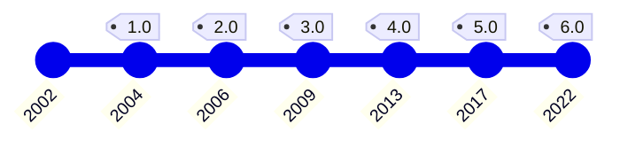
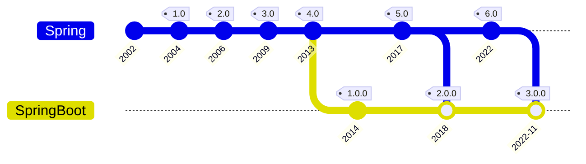
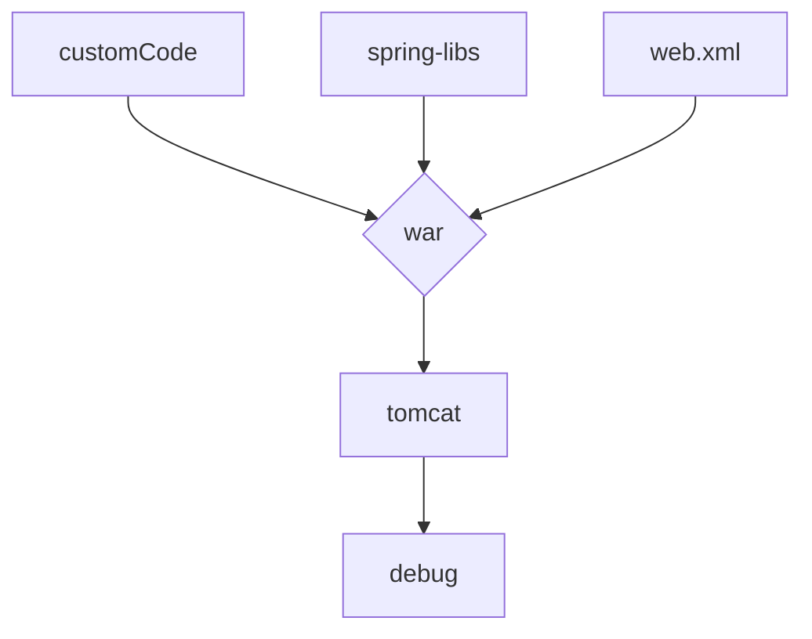
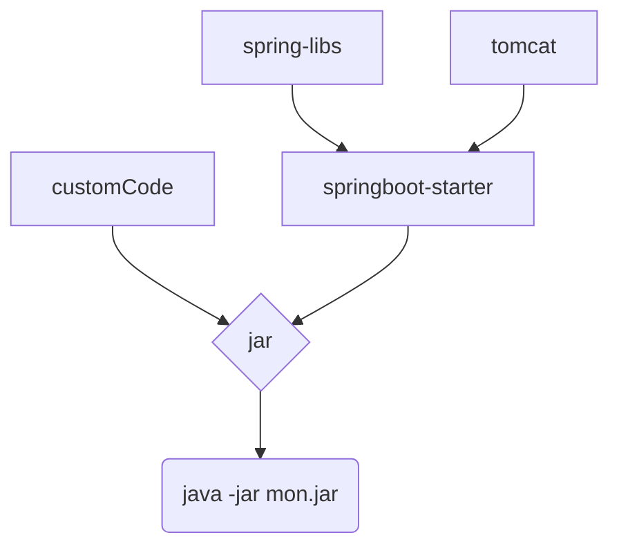

# Spring

---

# Spring != Jakarta

Spring a été créé en 2003

Alternative légère pour répondre à la complexité des premières versions des spécifications J2EE

Pas d'EJB

Mais des servlets

<!--

Concurrent de Jakarta sur certains points

Utilisateur sur d'autres
-->

---
layout: full
transition: fade
---

# Spring - Histoire

<!--

Springboot est une surcouche de Spring

Les deux sont liés
-->

---
layout: full
---

# Spring - Histoire

<!--

Springboot est une surcouche de Spring

Les deux sont liés
-->

---

# Spring

Spring est en premier lieu un système d'injection de dépendances

Spring fournit des librairies d'abstraction d'autres frameworks

spring-webmvc

spring-security

spring-data

spring-kafka

...

<!--

-->

---
layout: full
---

# Spring

<!--

Fonctionnement similaire, car il fonctionne dans un serveur JakartaEE

Remote debug pour travailler
-->

---
layout: full
---

# Spring Boot

<!--

Tomcat est une application en java donc peut être dans le jar

On parle de fatJar # 1 jar avec tout dedans

Debug direct comme si c'était un projet simple
-->

---
layout: TwoColumnsTitle
clicks: 2
---

::title::

# Spring vs Spring Boot

::left::

Spring

</img>

::right::

 0">SpringBoot

</img>
</img>

<!--

Spring est souvant présenté comme une sorte de boite à outils

SpringBoot comme le résultat direct

C'est pas si simple même si ça l'est plus
-->
