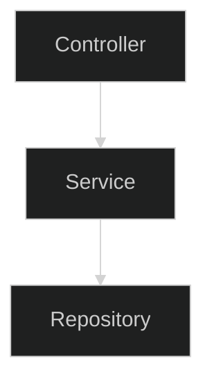
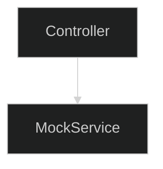

## Tests


---
layout: full
class: text-left
---

## Pyramide des Tests


---
layout: full
class: text-left
---

## Tests unitaires

Ces tests ne sont pas liés à l'utilisation de spring.

On peut utiliser un framework de test au choix (junit, spock...)
et un système d'assertion au choix (junit, assertk...).

Junit est embarqué dans les dépendances Spring.

---
layout: full
class: text-left
---

## Tests unitaires

```kotlin
@Service
class DummyService {

    fun doSomething(pony: String) = if (pony.length < 3) {
        "bad"
    } else {
        "good"
    }
}
```

```kotlin
class DummyServiceTest {

    private val service = DummyService()

    @Test
    fun `length gt 3 is good`() {
        // WHEN
       val result = service.doSomething("pony")
        // THEN
        assertThat(result).isEqualTo("good") // assertK
    }
}
```

---
layout: TwoColumnsTitle
class: text-left
---

::title::

## Tests unitaires

::left::

```kotlin
@TestInstance(PER_CLASS)
class PonyTest {
    @BeforeAll
    fun beforeAll() = println("before all")
    @BeforeEach
    fun beforeEach() = println("before each")
    @Test
    fun test1() = println("test1")
    @Test
    fun test2() = println("test2")
    @AfterEach
    fun afterEach() = println("after each")
    @AfterAll
    fun afterAll() = println("after all")
}
```

::right::

```kotlin
before all
before each
test1
after each
before each
test2
after each
after all
```

---
layout: full
class: text-left
---

## Tests d'intégration

```kotlin
@Service
class DummyService {

    fun doSomething(pony: String) = if (pony.length < 3) {
        "bad"
    } else {
        "good"
    }
}
```

````md magic-move
```kotlin
@SpringBootTest // Cherche et lance le SpringBootApplication
class DummyServiceTest {
}
```
```kotlin
@SpringBootTest // Cherche et lance le SpringBootApplication
class DummyServiceTest {
    @Autowired // Récupère le bean dans le contexte spring
    private lateinit var service: DummyService
}
```
```kotlin
@SpringBootTest // Cherche et lance le SpringBootApplication
class DummyServiceTest {
    @Autowired // Récupère le bean dans le contexte spring
    private lateinit var service: DummyService

    @Test
    fun `length gt 3 is good`() {
        // WHEN
       val result = service.doSomething("pony")
        // THEN
        assertThat(result).isEqualTo("good") // assertK
    }
}
```
````

---
layout: full
class: text-left
---


`@SpringBootTest` ne fonctionne que dans un sous package de l'application `@SpringBootApplication`


---
layout: cover
---

# Bouchons (mock)

## Avec Mockk (Mockito en Kotlin)

---
layout: full
class: text-left
---

```kotlin
@Service
class DummyService() {
    fun callDep(pony: String) = dependency.call()
}
```

````md magic-move
```kotlin
@SpringBootTest
class DummyServiceIntTest {
    @Autowired
    private lateinit var service: DummyService

    @Test
    fun `call good`() {
        // WHEN
        val result = service.callDep("pony") // call dependency bean
        // THEN
        assertThat(result).isEqualTo("good")
    }
}
```

```kotlin
@SpringBootTest
class DummyServiceIntTest {
    @MockkBean
    private lateinit var dependency: Dependency
    @Autowired
    private lateinit var service: DummyService

    @Test
    fun `call good`() {
        // WHEN
 🚫     val result = service.callDep("pony") // call the mock
        // THEN
        assertThat(result).isEqualTo("good")
    }
}
```

```kotlin
@SpringBootTest
class DummyServiceIntTest {
    @MockkBean
    private lateinit var dependency: Dependency
    @Autowired
    private lateinit var service: DummyService

    @Test
    fun `call good`() {
        // GIVEN
        every { dependency.call() } returns true
        // WHEN
        val result = service.callDep("pony") // call the mock
        // THEN
        assertThat(result).isEqualTo("good")
    }
}
```
````

---
layout: full
class: text-left
---

# Mockk Every

<div v-click>

## Réponse sans regarder le paramètre

```kotlin
every { dependency.call(any()) } returns true
```

</div>
<div v-click>

## Réponse seulement si le paramètre est exactement celui attendu

```kotlin
every { dependency.call(Pony("name") } returns "23"
```

</div>
<div v-click>

## Envoi d'une excéption

```kotlin
every { dependency.call(more(10), any()) } throws Exception("Nope")
```

</div>
<div v-click>

## Appel d'une fonction réelle

```kotlin
every { dependency.call(any(), any()) } answers { callRealMethod() }
```

</div>
<div v-click>

## Changer la valeur

```kotlin
every { dependency.call(eq(42), any()) } returnsMany listOf(1,2,3)
```

</div>

---
layout: full
class: text-left
---

```kotlin
@Service
class DummyService() {
    fun callDep(pony: String) = dependency.call()
}
```

````md magic-move
```kotlin
@SpringBootTest
class DummyServiceIntTest {
    @Autowired
    private lateinit var service: DummyService

    @Test
    fun `call good`() {
        // WHEN
        val result = service.callDep("pony") // call dependency bean
        // THEN
        assertThat(result).isEqualTo("good")
    }
}
```

```kotlin
@SpringBootTest
class DummyServiceIntTest {
    @SpykBean
    private lateinit var dependency: Dependency
    @Autowired
    private lateinit var service: DummyService

    @Test
    fun `call good`() {
        // WHEN
        val result = service.callDep("pony") // call dependency bean
        // THEN
        assertThat(result).isEqualTo("good")
    }
}
```

```kotlin
@SpringBootTest
class DummyServiceIntTest {
    @SpykBean
    private lateinit var dependency: Dependency
    @Autowired
    private lateinit var service: DummyService

    @Test
    fun `call good`() {
        // GIVEN
        every { dependency.call() } returns true
        // WHEN
        val result = service.callDep("pony") // call the mock
        // THEN
        assertThat(result).isEqualTo("good")
    }
}
```

```kotlin
@SpringBootTest
class DummyServiceIntTest {
    @SpykBean
    private lateinit var dependency: Dependency
    @Autowired
    private lateinit var service: DummyService

    @Test
    fun `call good`() {
        // GIVEN
        every { dependency.call() } returns true
        // WHEN
        val result = service.callDep("pony") // call the mock
        // THEN
        assertThat(result).isEqualTo("good")
        verify(exactly = 1) { dependency.call() }
    }
}
```
````

---
layout: full
class: text-left
---

## Tests

````md magic-move
```kotlin
@SpringBootTest
class MovieControllerTest {
}
```

```kotlin
@AutoConfigureMockMvc
@SpringBootTest
class MovieControllerTest {

  @Autowired
  lateinit var mockMvc: MockMvc
}
```
```kotlin
@AutoConfigureMockMvc
@SpringBootTest
class MovieControllerTest {

  @Autowired
  lateinit var mockMvc: MockMvc

  fun post() {
    mockMvc.post("/api/demo") // mockMvc.perform(post("/api/movies"))
  }
}
```
```kotlin
@AutoConfigureMockMvc
@SpringBootTest
class MovieControllerTest {

  @Autowired
  lateinit var mockMvc: MockMvc

  fun post() {
    mockMvc.post("/api/demo") {
        contentType = MediaType.APPLICATION_JSON
        content = ObjectMapper()
            .writeValueAsString(DemoEntity(name = "name"))
    }
  }
}
```
```kotlin
@AutoConfigureMockMvc
@SpringBootTest
class MovieControllerTest {

  @Autowired
  lateinit var mockMvc: MockMvc

  fun post() {
    mockMvc.post("/api/demo") {
        contentType = MediaType.APPLICATION_JSON
        content = ObjectMapper()
            .writeValueAsString(DemoEntity(name = "name"))
    }
    .andExpect {
        status { isOk() }
    }
  }
}
```
```kotlin
@AutoConfigureMockMvc
@SpringBootTest
class MovieControllerTest {

  @Autowired
  lateinit var mockMvc: MockMvc

  fun post() {
    mockMvc.post("/api/demo") {
        contentType = MediaType.APPLICATION_JSON
        content = ObjectMapper()
            .writeValueAsString(DemoEntity(name = "name"))
    }
    .andExpect {
        status { isOk() }
        content { jsonPath("$.name", `is`("name")) }
    }
  }
}
```
````

<!--

Spring fournit un outil pour faire des tests d'appels API

Le but est de simuler des appels externes,
sans avoir à faire toute la Configuration d'un client HTTP

L'activation se fait par l'ajout de @AutoConfigureMockMvc,
et on peut injecter MockMvc

On peut le faire à la manière de Java ou utiliser le DSL Kotlin

Le DSL Kotlin est moins verbeux, donc souvant plus lisible

Ici on donne le verbe http, le endpoint

Pour un POST on va souvent donner un contentType et un content

Le content est une String,
ObjectMapper est un serializer qui transforme l'objet en json

De base c'est aussi jackson qui est utilisé pour la serialization spring

On peut faire des assertions sur le résultat,
ici le code retour

Ou sur le contentu, par exemple en Json path
-->

---
layout: full
class: text-left
---

## MockMvc

````md magic-move
```kotlin
fun get() {
    mockMvc.get("/api/demo/{id}?param=value", "theId") {
        headers {
            contentLanguage = Locale.FRANCE
        }
        param("name", "value")
    }
    .andExpect {
        status { isBadRequest() }
    }
  }
```
```kotlin
fun get() {
    mockMvc.get("/api/demo/{id}?param=value", "theId") {
        headers {
            contentLanguage = Locale.FRANCE
        }
        param("name", "value")
    }
    .andDo { print() }
    .andExpect {
        status { isBadRequest() }
    }
  }
```
````

<!--

Le DSL permet d'exprimer la requête

Les params dans l'url ou dans le DSL

On peut donner des headers

On peut print le résultat, ça peut-être utile en cas d'échec d'un test sur la CI
-->

---
layout: TwoColumnsTitle
class: text-left
---

::title::

## Layers

::left::

@SpringBootTest



::right::

<div v-click>

@WebMvcTest



</div>

<!--

Spring propose des tests de couche (layer).

Ces tests ne lancent qu'une partie de l'application.

Pour la partie web il faut remplacer @SpringBootTest par @WebMvcTest.
-->

---
layout: full
class: text-left
---

## WebMvcTest

````md magic-move
```kotlin
@WebMvcTest
class DemoControllerTest {

    @MockkBean
    private lateinit var demoRepository: Repository
    @Autowired
    private lateinit var mockMvc: MockMvc

    @Test
    fun get() {
        every { demoRepository.save(any()) } returns Unit
        mockMvc.get("/api/demo")
                .andExpect { status { isOk() } }
    }
}
```

```kotlin
@WebMvcTest(DemoController::class)
class DemoControllerTest {

    @MockkBean
    private lateinit var demoRepository: Repository
    @Autowired
    private lateinit var mockMvc: MockMvc

    @Test
    fun get() {
        every { demoRepository.save(any()) } returns Unit
        mockMvc.get("/api/demo")
                .andExpect { status { isOk() } }
    }
}
```
````
<!--

On peut remplacer les deux annotations par WebMvcTest

Mais il faut fournir des mocks des beans

Pour limiter encore plus,
on peut limiter à un controlleur
-->
