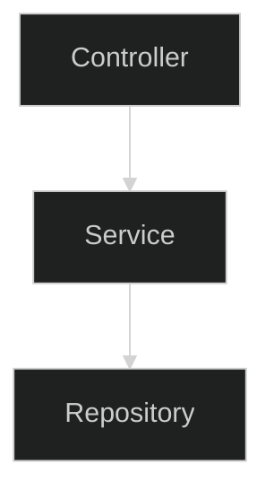
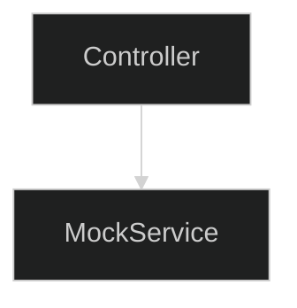

# Tests

---
layout: image
image: /code_coverage.jpg
backgroundSize: contain
---

---
layout: full
class: text-left
---

## Pyramide des Tests


---
layout: full
class: text-left
---

## Tests unitaires

Ces tests ne sont pas liés à l'utilisation de spring.

On peut utiliser un framework de test au choix (junit, spock...)
et un système d'assertion au choix (junit, assertk...).

Junit est embarqué dans les dépendances Spring.

---
layout: full
class: text-left
---

## Tests unitaires

```kotlin
@Service
class DummyService {

    fun doSomething(pony: String) = if (pony.length < 3) {
        "bad"
    } else {
        "good"
    }
}
```

```kotlin
class DummyServiceTest {

    private val service = DummyService()

    @Test
    fun `length gt 3 is good`() {
        // WHEN
       val result = service.doSomething("pony")
        // THEN
        assertThat(result).isEqualTo("good") // assertK
    }
}
```

---
layout: TwoColumnsTitle
class: text-left
---

::title::

## Tests unitaires

::left::

```kotlin
@TestInstance(PER_CLASS)
class PonyTest {
    @BeforeAll
    fun beforeAll() = println("before all")
    @BeforeEach
    fun beforeEach() = println("before each")
    @Test
    fun test1() = println("test1")
    @Test
    fun test2() = println("test2")
    @AfterEach
    fun afterEach() = println("after each")
    @AfterAll
    fun afterAll() = println("after all")
}
```

::right::

```txt
before all
before each
test1
after each
before each
test2
after each
after all
```

---
layout: full
class: text-left
---

## Tests d'intégration

```kotlin
@Service
class DummyService {

    fun doSomething(pony: String) = if (pony.length < 3) {
        "bad"
    } else {
        "good"
    }
}
```

````md magic-move
```kotlin
@SpringBootTest // Cherche et lance le SpringBootApplication
class DummyServiceTest {
}
```
```kotlin
@SpringBootTest // Cherche et lance le SpringBootApplication
class DummyServiceTest {
    @Autowired // Récupère le bean dans le contexte spring
    private lateinit var service: DummyService
}
```
```kotlin
@SpringBootTest // Cherche et lance le SpringBootApplication
class DummyServiceTest {
    @Autowired // Récupère le bean dans le contexte spring
    private lateinit var service: DummyService

    @Test
    fun `length gt 3 is good`() {
        // WHEN
       val result = service.doSomething("pony")
        // THEN
        assertThat(result).isEqualTo("good") // assertK
    }
}
```
````

---
layout: full
class: text-left
---


`@SpringBootTest` ne fonctionne que dans un sous package de l'application `@SpringBootApplication`


---
layout: cover
---

# Bouchons (mock)

## Avec Mockk (Mockito en Kotlin)

---
layout: full
class: text-left
---

```kotlin
@Service
class DummyService(val dependency: Dependency) {
    fun callDep(pony: String) = dependency.call()
}
```

````md magic-move
```kotlin
@SpringBootTest
class DummyServiceIntTest {
    @Autowired
    private lateinit var service: DummyService

    @Test
    fun `call good`() {
        // WHEN
        val result = service.callDep("pony") // call dependency bean
        // THEN
        assertThat(result).isEqualTo("good")
    }
}
```

```kotlin
@SpringBootTest
class DummyServiceIntTest {
    @MockkBean
    private lateinit var dependency: Dependency
    @Autowired
    private lateinit var service: DummyService

    @Test
    fun `call good`() {
        // WHEN
 🚫     val result = service.callDep("pony") // call the mock
        // THEN
        assertThat(result).isEqualTo("good")
    }
}
```

```kotlin
@SpringBootTest
class DummyServiceIntTest {
    @MockkBean
    private lateinit var dependency: Dependency
    @Autowired
    private lateinit var service: DummyService

    @Test
    fun `call good`() {
        // GIVEN
        every { dependency.call() } returns "good"
        // WHEN
        val result = service.callDep("pony") // call the mock
        // THEN
        assertThat(result).isEqualTo("good")
    }
}
```
````

---
layout: full
class: text-left
---

# Mockk Every

<div v-click>

## Réponse sans regarder le paramètre

```kotlin
every { dependency.call(any()) } returns true
```

</div>
<div v-click>

## Réponse seulement si le paramètre est exactement celui attendu

```kotlin
every { dependency.call(Pony("name")) } returns "23"
```

</div>
<div v-click>

## Envoi d'une exception

```kotlin
every { dependency.call(more(10), any()) } throws Exception("Nope")
```

</div>
<div v-click>

## Appel d'une fonction réelle

```kotlin
every { dependency.call(any(), any()) } answers { callRealMethod() }
```

</div>
<div v-click>

## Réponses successives

```kotlin
every { dependency.call(eq(42), any()) } returnsMany listOf(1,2,3)
```

</div>

---
layout: full
class: text-left
---

```kotlin
@Service
class DummyService(val dependency: Dependency) {
    fun callDep(pony: String) = dependency.call()
}
```

````md magic-move
```kotlin
@SpringBootTest
class DummyServiceIntTest {
    @Autowired
    private lateinit var service: DummyService

    @Test
    fun `call good`() {
        // WHEN
        val result = service.callDep("pony") // call dependency bean
        // THEN
        assertThat(result).isEqualTo("good")
    }
}
```

```kotlin
@SpringBootTest
class DummyServiceIntTest {
    @MockkSpyBean
    private lateinit var dependency: Dependency
    @Autowired
    private lateinit var service: DummyService

    @Test
    fun `call good`() {
        // WHEN
        val result = service.callDep("pony") // call dependency bean
        // THEN
        assertThat(result).isEqualTo("good")
    }
}
```

```kotlin
@SpringBootTest
class DummyServiceIntTest {
    @MockkSpyBean
    private lateinit var dependency: Dependency
    @Autowired
    private lateinit var service: DummyService

    @Test
    fun `call good`() {
        // GIVEN
        every { dependency.call() } returns "good"
        // WHEN
        val result = service.callDep("pony") // call the mock
        // THEN
        assertThat(result).isEqualTo("good")
    }
}
```

```kotlin
@SpringBootTest
class DummyServiceIntTest {
    @MockkSpyBean
    private lateinit var dependency: Dependency
    @Autowired
    private lateinit var service: DummyService

    @Test
    fun `call good`() {
        // GIVEN
        every { dependency.call() } returns "good"
        // WHEN
        val result = service.callDep("pony") // call the mock
        // THEN
        assertThat(result).isEqualTo("good")
        verify(exactly = 1) { dependency.call() }
    }
}
```
````

---
layout: full
class: text-left
---

## Tests

````md magic-move
```kotlin
@SpringBootTest
class MovieControllerTest {
}
```

```kotlin
@AutoConfigureMockMvc
@SpringBootTest
class MovieControllerTest {

  @Autowired
  lateinit var mockMvc: MockMvc
}
```
```kotlin
@AutoConfigureMockMvc
@SpringBootTest
class MovieControllerTest {

  @Autowired
  lateinit var mockMvc: MockMvc

  @Test
  fun post() {
    mockMvc.post("/api/demo") // mockMvc.perform(post("/api/movies"))
  }
}
```
```kotlin
@AutoConfigureMockMvc
@SpringBootTest
class MovieControllerTest {

  @Autowired
  lateinit var mockMvc: MockMvc

  @Test
  fun post() {
    mockMvc.post("/api/demo") {
        contentType = MediaType.APPLICATION_JSON
        content = """{"name":"name"}"""
    }
  }
}
```
```kotlin
@AutoConfigureMockMvc
@SpringBootTest
class MovieControllerTest {

  @Autowired
  lateinit var mockMvc: MockMvc

  @Autowired
  lateinit var jsonMapper: JsonMapper

  @Test
  fun post() {
    mockMvc.post("/api/demo") {
        contentType = MediaType.APPLICATION_JSON
        content = """{"name":"name"}"""
    }
  }
}
```
```kotlin
@AutoConfigureMockMvc
@SpringBootTest
class MovieControllerTest {

  @Autowired
  lateinit var mockMvc: MockMvc

  @Autowired
  lateinit var jsonMapper: JsonMapper

  @Test
  fun post() {
    mockMvc.post("/api/demo") {
        contentType = MediaType.APPLICATION_JSON
        content = jsonMapper
            .writeValueAsString(DemoEntity(name = "name"))
    }
  }
}
```
```kotlin
@AutoConfigureMockMvc
@SpringBootTest
class MovieControllerTest {

  @Autowired
  lateinit var mockMvc: MockMvc

  @Autowired
  lateinit var jsonMapper: JsonMapper

  @Test
  fun post() {
    mockMvc.post("/api/demo") {
        contentType = MediaType.APPLICATION_JSON
        content = jsonMapper
            .writeValueAsString(DemoEntity(name = "name"))
    }
    .andExpect {
        status { isOk() }
    }
  }
}
```
```kotlin
@AutoConfigureMockMvc
@SpringBootTest
class MovieControllerTest {

  @Autowired
  lateinit var mockMvc: MockMvc

  @Autowired
  lateinit var jsonMapper: JsonMapper

  @Test
  fun post() {
    mockMvc.post("/api/demo") {
        contentType = MediaType.APPLICATION_JSON
        content = jsonMapper
            .writeValueAsString(DemoEntity(name = "name"))
    }
    .andExpect {
        status { isOk() }
        content { jsonPath("$.name", `is`("name")) }
    }
  }
}
```
````

<!--

Spring fournit un outil pour faire des tests d'appels API

Le but est de simuler des appels externes,
sans avoir à faire toute la Configuration d'un client HTTP

L'activation se fait par l'ajout de @AutoConfigureMockMvc,
et on peut injecter MockMvc

On peut le faire à la manière de Java ou utiliser le DSL Kotlin

Le DSL Kotlin est moins verbeux, donc souvent plus lisible

Ici on donne le verbe http, le endpoint

Pour un POST on va souvent donner un contentType et un content

Le content est une String : le plus simple est d'écrire le JSON à la main.
Avantage : on teste le contrat réel, si un champ du DTO est renommé le test casse

Autre possibilité : laisser un serializer produire le JSON.
JsonMapper (Jackson 3) transforme l'objet en json

On injecte celui configuré par Spring Boot plutôt que d'en créer un :
même config que l'appli (module Kotlin inclus), c'est lui qui sérialise les réponses des controllers

C'est l'occasion de redire que @Autowired sert encore : dans une classe de test,
c'est JUnit qui instancie la classe, l'injection par propriété (lateinit var) y reste l'usage courant
(l'injection par constructeur est possible en test, mais rarement utilisée)

On peut faire des assertions sur le résultat,
ici le code retour

Ou sur le contenu, par exemple en Json path
-->

---
layout: full
class: text-left
---

## MockMvc

````md magic-move
```kotlin
@Test
fun get() {
    mockMvc.get("/api/demo/{id}?param=value", "theId") {
        headers {
            contentLanguage = Locale.FRANCE
        }
        param("name", "value")
    }
    .andExpect {
        status { isBadRequest() }
    }
  }
```
```kotlin
@Test
fun get() {
    mockMvc.get("/api/demo/{id}?param=value", "theId") {
        headers {
            contentLanguage = Locale.FRANCE
        }
        param("name", "value")
    }
    .andDo { print() }
    .andExpect {
        status { isBadRequest() }
    }
  }
```
````

<!--

Le DSL permet d'exprimer la requête

Les params dans l'url ou dans le DSL

On peut donner des headers

On peut print le résultat, ça peut-être utile en cas d'échec d'un test sur la CI
-->

---
layout: TwoColumnsTitle
---

::title::

## Layers

::left::

@SpringBootTest


```mermaid
%%{init: { 'logLevel': 'debug', 'theme': 'dark'} }%%
flowchart TD
    Controller --> Service
    Service --> Repository
```

::right::

<div v-click>

@WebMvcTest


```mermaid
%%{init: { 'logLevel': 'debug', 'theme': 'dark'} }%%
flowchart TD
    Controller --> MockService
```

</div>

<!--

Spring propose des tests de couche (layer).

Ces tests ne lancent qu'une partie de l'application.

Pour la partie web il faut remplacer @SpringBootTest par @WebMvcTest.
-->

---
layout: full
class: text-left
---

## WebMvcTest

````md magic-move
```kotlin
@WebMvcTest
class DemoControllerTest {

    @MockkBean
    private lateinit var demoService: DemoService
    @Autowired
    private lateinit var mockMvc: MockMvc

    @Test
    fun get() {
        every { demoService.findAll() } returns listOf(DemoEntity(name = "name"))
        mockMvc.get("/api/demo")
                .andExpect {
                    status { isOk() }
                    content { jsonPath("$[0].name", `is`("name")) }
                }
    }
}
```

```kotlin
@WebMvcTest(DemoController::class)
class DemoControllerTest {

    @MockkBean
    private lateinit var demoService: DemoService
    @Autowired
    private lateinit var mockMvc: MockMvc

    @Test
    fun get() {
        every { demoService.findAll() } returns listOf(DemoEntity(name = "name"))
        mockMvc.get("/api/demo")
                .andExpect {
                    status { isOk() }
                    content { jsonPath("$[0].name", `is`("name")) }
                }
    }
}
```
````
<!--

On peut remplacer les deux annotations par WebMvcTest

Mais il faut fournir des mocks des beans

Pour limiter encore plus,
on peut limiter à un controlleur
-->

---
layout: TwoColumnsTitle
class: text-left
---

::title::

## Alternatives à MockMvc

::left::

**MockMvcTester** (assertions AssertJ)

```kotlin
@Autowired
lateinit var mvc: MockMvcTester

@Test
fun get() {
    mvc.get().uri("/api/demo")
        .assertThat()
        .hasStatusOk()
        .bodyJson()
        .extractingPath("$[0].name")
        .isEqualTo("name")
}
```

::right::

**RestTestClient** (`@AutoConfigureRestTestClient`)

```kotlin
@Autowired
lateinit var client: RestTestClient

@Test
fun get() {
    client.get().uri("/api/demo")
        .exchange()
        .expectStatus().isOk()
        .expectBody()
        .jsonPath("$[0].name").isEqualTo("name")
}
```

<!--

MockMvc et son DSL Kotlin restent valides, ce sont des alternatives

MockMvcTester : même moteur que MockMvc, mais assertions AssertJ fluides.
Injecté automatiquement avec @AutoConfigureMockMvc / @WebMvcTest

RestTestClient : nouveau client de test de Spring 7, même API que WebTestClient.
Dépendance spring-boot-resttestclient + @AutoConfigureRestTestClient.
Il passe par MockMvc, ou par un vrai serveur si le test en démarre un (RANDOM_PORT) :
le même test fonctionne dans les deux cas
-->
