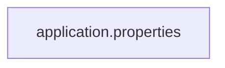
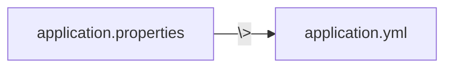
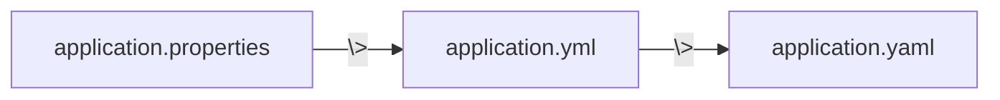
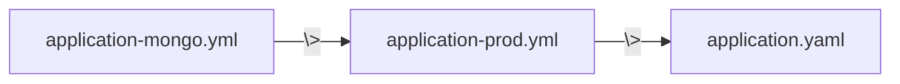
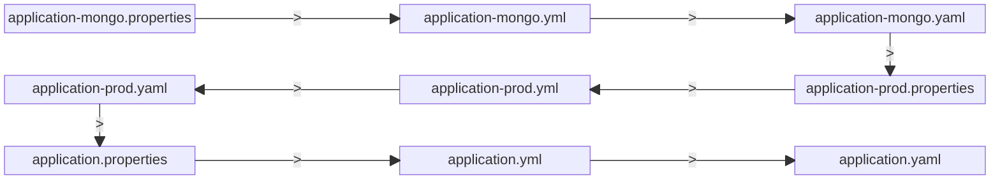

# Application Configuration

---
layout: full
class: text-left
---

## Application Configuration

src/resources/application.properites

```properties
spring.application.name=demo
spring.main.lazy-initialization=true
```

<div v-click>

src/resources/application.yml

```yaml
spring:
    application.name: demo
    main.lazy-initialization: true
```

</div>

<div v-click>

src/resources/application.yaml

```yaml
spring:
    application.name: demo
    main.lazy-initialization: true
```

</div>

<!--
Trois moyens de fournir des properites,
avec un fichier properties,
un yml,
un yaml
-->

---
layout: full
class: text-left
---

src/resources/application.yaml

<div v-click>

```yaml
spring:
    application.name: demo
    main.lazy-initialization: true
```

</div>
<div v-click>

```yaml
spring:
    application.name: demo
    main:
      lazy-initialization: true
```

</div>
<div v-click>

```yaml
spring:
    application.name: demo
    main:
      lazyInitialization: true
```

</div>

---
layout: full
class: text-left
transition: fade
---

## properties



---
layout: full
class: text-left
transition: fade
---

## properties > yml



---
layout: full
class: text-left
transition: fade
---

## properties > yml > yaml



<!--
Les fichiers properties passent avant les yml qui passent avant les yaml
-->

---
layout: full
class: text-left
transition: fade
---

## properties > yml > yaml


```properties [application.properites]
spring.application.name=demoProperties
```

```yaml [application.yml]

spring:
    application.name: demoYml
```

```yaml [application.yaml]

spring:
    application.name: demoYaml
```

<div v-click>

spring.application.name = demoProperties

</div>

---
layout: full
class: text-left
---

## Profiles

Les profils son un moyen de séparer des parties de la configuration

Exemple:

un profile MySql

un profile MongoDb

<!--

-->

---
layout: full
class: text-left
---

## Profiles

src/resources/application-dev.yml

```yaml [application-dev.yml]

spring:
    application.name: myDevConfig
```

src/resources/application-prod.yml

```yaml [application-dev.yml]

spring:
    application.name: myProdConfig
```

---
layout: full
class: text-left
---

## Activer un profile

Dans les fichiers application.*

```yaml [application.yml]
spring.profiles.active: dev,mysql
```

<div v-click>

En variable d'environnement

```bash
export spring_profiles_active=dev
```

</div>
<div v-click>

JVM parameter

```bash
java -jar app.jar -Dspring.profiles.active=prod,mongo
```

</div>

<!--
Par fichier de properties, uniquement dans le fichier racine
-->

---
layout: full
class: text-left
---

## Ordre

```
-Dspring.profiles.active=prod,mongo
```



```yaml [application-mongo.yml]

spring:
    application.name: demoMongo
```

```yaml [application-prod.yaml]

spring:
    application.name: demoProd
```

```yaml [application.yaml]

spring:
    application.name: demoYaml
```

<div v-click>

spring.application.name = demoMongo

</div>

<!--
Les profiles sont dans l'ordre inverse
-->

---
layout: full
class: text-left
---

## Ordre

```
-Dspring.profiles.active=prod,mongo
```



<!--
Au complet si on joue avec les extensions

/!\ pas une bonne pratique
-->

---
layout: cover
hideInToc: false
---

## Accès aux propriétés

---
layout: full
class: text-left
---

## Injection

```kotlin
class Demo {
  @Value("\${custom.path.value}")
  private lateinit var value: String
}
```

<div v-click>

## Injection avec fallback

```kotlin
class Demo {
  @Value("\${custom.path.value:defaultValue}")
  private lateinit var value: String
}
```

</div>

<!--
Injection comme une champs, 
une sorte d'autowired de la valeur

Avec une valeur par défaut
-->

---
layout: TwoColumnsTitle
class: text-left
---

::title::

## ConfigurationProperties

::left::

```yaml {all|1-2|3}{at:'0'}
path:
  custom-prop:
    demo: val1
    anotherDemo: val2
```

::right::

````md magic-move
```kotlin {all|1|3|all}{at:'0'}
@ConfigurationProperties("path.custom-prop")
data class CustomProperties(
    val demo: String,
    val anotherDemo: String,
)
```

```kotlin
@ConfigurationProperties("path.custom-prop")
data class CustomProperties(
    @NotBlank val demo: String, 
    @Min(10) val anotherDemo: Int,
)
```
````

<div v-click.at='3'>

```kotlin
@Configuration
@EnableConfigurationProperties(CustomProperties::class)
class PropertiesConfig
```

</div>

<!--
On peut transformer les properties en instance de class

@ConfigurationProperties donne la base du nom

@EnableConfigurationProperties active la lécture

C'est un bean, donc on peut réutiliser la validation
-->

---
layout: full
class: text-left
---

## Utilisation

EnableConfigurationProperties = Création de bean

```kotlin
@Service
class Demo(val properties: CustomProperties) {
}
```

```kotlin
@Configuration
class Demo {
    @Bean
    fun aBean(val properties: CustomProperties) =...
}
```

<!--
On inject la classe comme un bean
-->

---
layout: full
class: text-left
---

## Conditional Bean

````md magic-move
```kotlin
@Configuration
class DatabaseConfig {

    @ConditionalOnProperty("db.external", havingValue = "true")
    @Bean
    fun mongo(): Database = UserMongoRepository()
}
```

```kotlin
@Configuration
class DatabaseConfig {

    @ConditionalOnProperty("db.external", havingValue = "true")
    @Bean
    fun mongo(): Database = UserMongoRepository()

    @ConditionalOnProperty("db.external", havingValue = "false")
    @Bean
    fun inMemory(): Database = UserInMemoryRepository()
}
```

```kotlin
@Configuration
class DatabaseConfig {

    @ConditionalOnProperty("db.external", havingValue = "true")
    @Bean
    fun mongo(): Database = UserMongoRepository()

    @ConditionalOnProperty("db.external", havingValue = "false", matchIfMissing = true)
    @Bean
    fun inMemory(): Database = UserInMemoryRepository()
}
```
````

<!--
ConditionalOnProperty permet de créer le bean si la condition est validé

Donc on peut avoir donc un bean suivant le contenu de la variable

Et le matchIfMissing permet d'avoir un comportement par défaut
-->

---
layout: full
class: text-left
---

## Conditional Bean on Profile

```kotlin
@Configuration
class DatabaseConfig {

    @Bean
    @Profile("mongo")
    fun mongo(): Database = UserMongoRepository()

    @Bean
    @Profile("!mongo")
    fun inMemory(): Database = UserInMemoryRepository()
}
```

<!--
On peut aussi conditionner des beans sur des profiles
-->

---
layout: TwoColumnsTitle
class: text-left
---

::title::

## ConditionalOn

::left::

ConditionalOnProperty

ConditionalOnBean

ConditionalOnMissingBean

ConditionalOnClass

ConditionalOnJava

ConditionalOnResource

ConditionalOnExpression

ConditionalOnJndi

ConditionalOnThreading

::right::

ConditionalOnNotWarDeployment

ConditionalOnNotWebApplication

ConditionalOnCheckpointRestore

ConditionalOnCloudPlatform

ConditionalOnSingleCandidate

ConditionalOnWarDeployment

ConditionalOnWebApplication

ConditionalOnMissingClass

<!--
Il y a beaucoup de ConditionalOn*

ConditionalOnBean sur l'existance d'un bean

ConditionalOnClass sur l'existance d'une class dans le classpath

ConditionalOnJava sur la version de java

-->
