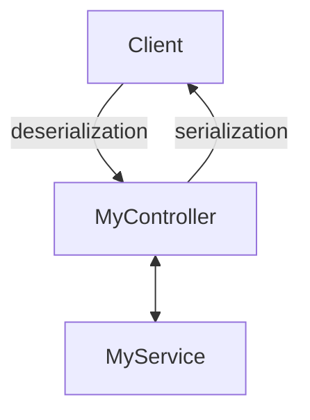
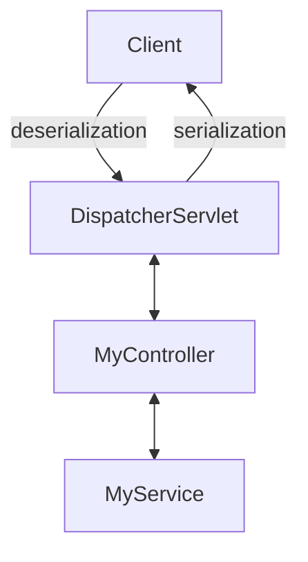
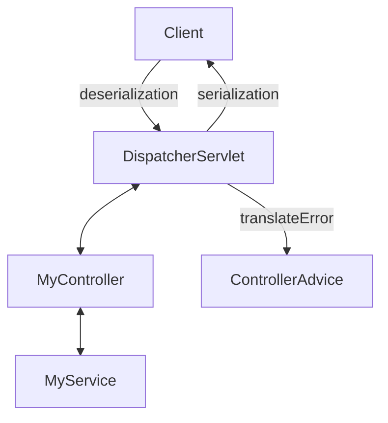

# Gestion des erreurs

---
layout: full
class: text-left
---

## Gestion des erreurs

Les erreurs de validation n'entrent pas dans le code de la fonction.

La gestion est externe et générique.

---
layout: full
---

## Current schema



<!--
Vision simple d'une application
-->

---
layout: full
---

## DispatcherServlet



<!--
En rentrant un peu dans spring,
il y a une couche pour passer de la servlet au controlleur
-->

---
layout: full
---

## DispatcherServlet



<!--
Ce dispatcher va gérer les erreurs en s'appuyant sur un ControllerAdvice
-->

---
layout: full
class: text-left
---

## DispatcherServlet - PSEUDO-code

```kotlin
fun dispatch(request: HttpServletRequest) {
    try {
        val parameters = deserialize(request)
        val handler = getHandler(request)
        val response = handler.handle(parameters)
        return serialize(response)
    } catch (e: Exception) {
        val response = errorHandler.handle(e)
        return serialize(response)
    }
}
```

<!--
Autrement dit en pseudo code il fait ca.
C'est une vision très très simplifié.
-->

---
layout: full
class: text-left
---

## ControllerAdvice

````md magic-move
```kotlin
@ControllerAdvice
class HttpErrorHandler {
}
```

```kotlin
@ControllerAdvice
class HttpErrorHandler {

    fun handleMethodArgumentNotValid(e: MethodArgumentNotValidException) =
        ResponseEntity.badRequest().body("You're arg is invalid")
}
```
```kotlin
@ControllerAdvice
class HttpErrorHandler {

    @ExceptionHandler(MethodArgumentNotValidException::class)
    fun handleMethodArgumentNotValid(e: MethodArgumentNotValidException) =
        ResponseEntity.badRequest().body("You're arg is invalid")
}
```
```kotlin {4-5}
@ControllerAdvice
class HttpErrorHandler {

    @ExceptionHandler(MethodArgumentNotValidException::class)
    fun handleMethodArgumentNotValid(e: MethodArgumentNotValidException) =
        ResponseEntity.badRequest().body("You're arg is invalid")
}
```

```kotlin
@ControllerAdvice
class HttpErrorHandler {

    @ExceptionHandler(MethodArgumentNotValidException::class)
    fun handleMethodArgumentNotValid(e: MethodArgumentNotValidException) =
        ResponseEntity.badRequest().body("You're arg is invalid")

    @ExceptionHandler(Exception::class)
    fun fallback(e: Exception) =
        ResponseEntity.internalServerError().body("Unhandled error")
}
```
````

<!--
Un ControllerAdvice est un Bean particulier.
Comme RestController ou @Configuration,
il a son propre cycle de vie.

On peut lui donner des methodes pour lui expliquer comment traiter une exception

Comme le RestController, 
il faut une annotation pour que Spring puisse faire le lien

La gestion, des exceptions, est en entonnoir

On peut traiter les erreurs spécialisées et avoir des couches de traitement de plus en plus génériques
-->

---
layout: full
class: text-left
---

## ControllerAdvice - Spring

````md magic-move
```kotlin
@ControllerAdvice
class HttpErrorHandler : ResponseEntityExceptionHandler() {
}
```
```kotlin
@ControllerAdvice
class HttpErrorHandler : ResponseEntityExceptionHandler() {

  override fun handleMethodArgumentNotValid(e: MethodArgumentNotValidException,
                                            headers: HttpHeaders,
                                            status: HttpStatusCode,
                                            request: WebRequest)
                                            : ResponseEntity<Any>? {
      return ResponseEntity.badRequest().body("You're arg is invalid")
  }
}
```

```kotlin
@ControllerAdvice
class HttpErrorHandler : ResponseEntityExceptionHandler() {

  override fun handleMethodArgumentNotValid(e: MethodArgumentNotValidException,
                                            headers: HttpHeaders,
                                            status: HttpStatusCode,
                                            request: WebRequest)
                                            : ResponseEntity<Any>? {
      return ResponseEntity.badRequest().body("You're arg is invalid")
  }

  @ExceptionHandler(MyCustomException::class)
  fun fallback(e: MyCustomException) =
      ResponseEntity.internalServerError().body("NO!")
}
```
````

<!--
Il est aussi possible d'étendre la gestion par défaut de Spring

Pour ça il faut étendre ResponseEntityExceptionHandler et surcharger les handlers
-->

---
layout: full
class: text-left
---

## Layered test

```kotlin
@WebMvcTest(DemoController::class)
class DemoDtoTest {

    @Autowired
    lateinit var mockMvc: MockMvc
    @MockkBean
    lateinit var demoService: DemoService

    @Test
    fun `happy path`() {
        // GIVEN
        every { demoService.list() } throws ImATeapotException()
        // WHEN
        mockMvc.get("/api/v1/demo")
            // THEN
            .andExpect {
                status { isBadRequest() }
            }
    }
}
```
