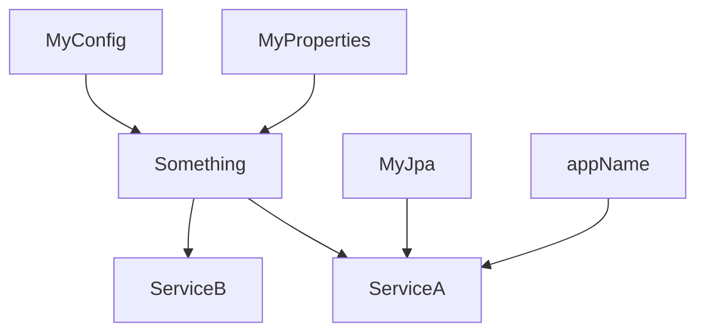

# Injection Reminder

<!--
On a un bean quand ? 

Comment Spring l'utilise ?
-->

---
layout: TwoColumns
class: text-left
---

::left::

```kotlin {all|1,4|5-6|7-8|11-12|14|18-19|24|all}
@ConfigurationProperties(prefix = "my")
data class MyProperties(val enabled: Boolean)

@EnableConfigurationProperties(MyProperties::class)
@Configuration
class MyConfig {
  @Bean
  fun something(prop: MyProperties) = Something(prop)
}

@Service
class ServiceA(
  val something: Something,
  @Value("\${app.name}") val appName: String,
  val db: MyJpa,
)

@Component
class ServiceB {
    @Autowired
    lateinit var something: Something
}

interface MyJpa : JpaRepository<MyEntity, Long>
```

::right::

<div v-if="$clicks < 8">
  <div v-motion-slide-left>Beans</div>
  <div v-click.at="1" v-motion-slide-left>MyProperties</div>
  <div v-click.at="2" v-motion-slide-left>MyConfig</div>
  <div v-click.at="3" v-motion-slide-left>Something</div>
  <div v-click.at="4" v-motion-slide-left>ServiceA</div>
  <div v-click.at="5" v-motion-slide-left>appName</div>
  <div v-click.at="6" v-motion-slide-left>ServiceB</div>
  <div v-click.at="7" v-motion-slide-left>MyJpa</div>
</div>

<div v-if="$clicks >= 8" v-motion-slide-right>



</div>

<div v-click.at="9">

1. Spring scan pour trouver les beans
2. Spring fait un arbre de dépendances des injections
3. L'injection se fait

</div>

---
layout: full
class: text-left
---

# tl;dr

## Injection constructeur >  Autowired

- Plus simple à tester
- Moins d'introspection

## ConfigurationProperties > @Value

- Plus simple à valider
- Plus simple a documenter (automatique avec spring-configuration-processor)
