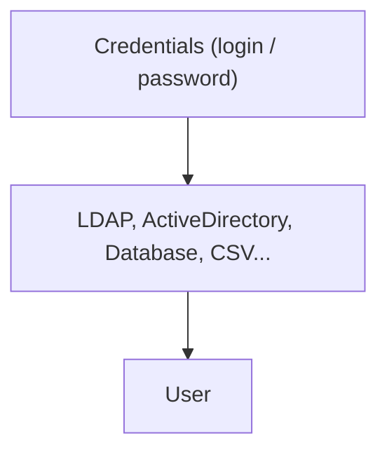

# Spring Security

<!--
C'est un sujet vaste et on va discuter d'une petite partie
-->

---
layout: full
class: text-left
---

## Vocabulaire

---
layout: full
class: text-left
---

## Authentication

**Qui suis-je?**



---
layout: full
class: text-left
---

## Authorization

**Que puis-je faire?**
Read ? Write ? Admin ? Publish?
Toujours après l'authentication

<v-click>

## Role

Ensemble de droits sur l'application

</v-click>
<v-click>

## User

Information de base sur l'utilisateur connécté (login, role...)

</v-click>
<v-click>

## UserDetail

API Spring pour faire la phase d'authentification

</v-click>

---
layout: full
class: text-left
---

## Dépendances

```kotlin
implementation("org.springframework.boot:spring-boot-starter-security")
testImplementation("org.springframework.security:spring-security-test")
```

<v-click>

## Attention

⚠️ **STARTER**

Ajouter cette dépandance active directement la sécurité

De base toute requete doit etre authentifié,
donc tout répond un 401.

</v-click>

---
layout: full
class: text-left
---

## Enable Web Security

````md magic-move
```kotlin
@Configuration
@EnableWebSecurity
class MySecurityConfig { 
}
```
```kotlin
import org.springframework.security.config.annotation.web.invoke

@Configuration
@EnableWebSecurity
class MySecurityConfig { 
}
```
```kotlin
import org.springframework.security.config.annotation.web.invoke

@Configuration
@EnableWebSecurity
class MySecurityConfig { 

    @Bean
    open fun filterChain(http: HttpSecurity): SecurityFilterChain {
    http {
        csrf { disable() }
    }
    return http.build()
    }
}
```
```kotlin
import org.springframework.security.config.annotation.web.invoke

@Configuration
@EnableWebSecurity
class MySecurityConfig { 

    @Bean
    open fun filterChain(http: HttpSecurity): SecurityFilterChain {
    http {
        csrf { disable() }
        authorizeHttpRequests {
            authorize("/ponies", permitAll)
            authorize(anyRequest, authenticated)
        }
    }
    return http.build()
    }
}
```
```kotlin
import org.springframework.security.config.annotation.web.invoke

@Configuration
@EnableWebSecurity
class MySecurityConfig { 

    @Bean
    open fun filterChain(http: HttpSecurity): SecurityFilterChain {
    http {
        csrf { disable() }
        authorizeHttpRequests {
            authorize("/ponies", permitAll)
            authorize(anyRequest, authenticated)
        }
        httpBasic { }
        formLogin { }
    }
    return http.build()
    }
}
```
````

<!--
Ajouter l'annotation EnableWebSecurity va signaler à Spring qu'il doit chercher des beans de configuration de spring-security pour du MVC

Ce bean permet de configurer le fonctionnement de spring security
-->

---
layout: full
class: text-left
---

## Form Login

```kotlin
formLogin { }
```

Cette partie ajoute une JSP pour pouvoir s'authentifier par formulaire `/login` && `/logout`


<!--
FormLogin permet de se connecter via un formulaire,
de base un formulaire est généré par spring security a l'adresse `/login`.
Spring fournir aussi un endpoint `/logout`.

La session est gére par un cookie `JSESSIONID`.
-->

---
layout: full
class: text-left
---

## Http Basic

```kotlin
httpBasic { }
```

Cette partie ajoute la possibilité s'authentifier au format basic

```bash
BASE=$(echo -ne "login:password" | base64 --wrap 0)

curl \
 -H "Authorization: Basic $BASE" \
 http://localhost:8080
```

<!--
Basic Auth comme d'autres (Bearer...) sont des moyens d'authentification pour des APIs

Pour Basic on fournit un login et un mot de passe encodé en base64 dans le header Authorization.
-->

---
layout: full
class: text-left
---

## Autres

Cross Site Request Forgery

```kotlin
csrf { disable() }
```

Cross-Origin Resource Sharing

```kotlin
cors { disable() }
```

⚠️ **Ne pas faire en PROD sauf cas particuliers**

<!--
On peut configuer ou supprimer des sécurités comme le CSRF ou le CORS
-->

---
layout: full
class: text-left
---

## authorizeHttpRequests

Permet de gérer les filtres par path http

```kotlin
  http {
    authorizeHttpRequests {
      authorize("/ponies", permitAll)
      authorize (HttpMethod.GET, "/**", permitAll)
      authorize("/admin", hasRole("ADMIN"))
      authorize(anyRequest, authenticated)
    }
  }
}
```

```kotlin
fun authorize(pattern: String,
              access: AuthorizationManager<RequestAuthorizationContext>)
```

<!--
Cette partie de la configuration permet de definir les droits d'accès.
On peut les donner par pattern ou pour toutes les requetes.

On peut enlever la sécurité pour certaines requetes (permitAll),
juste etre authentifié (authenticated),
ou définir des droits spécifiques par role, ip...)
-->

---
layout: full
class: text-left
---

## Alternative pour les droits

Permet de gérer les droits par fonction

```kotlin
@Configuration
@EnableWebSecurity
@EnableMethodSecurity
class MySecurityConfig { ... }
```

<v-click>

```kotlin
@PreAuthorize("hasRole('ADMIN')")
fun myMethod() ...
```

</v-click>
<!--
Une alternative à la gestion MVC par path,
la gestion par PreAuthorize sur les methodes
-->

---
layout: full
class: text-left
---

## Password Encoder

On encode au plus vite tout mot de passe

```kotlin
@Configuration
class MySecurityConfig {
    @Bean
    fun passwordEncoder(): PasswordEncoder {
        return BCryptPasswordEncoder()
    }
}
```

<!--
Avant de parler gestion authentification,
on ne stock jamais un mot de passe en claire.
-->

---
layout: full
class: text-left
---

## In Memory User Detail Manager

Version utile pour les tests.
A chaque redémarrage de l'application il faut refaire les utilisateurs.

```kotlin
@Configuration
class MySecurityConfig {
    @Bean
    fun passwordEncoder(): PasswordEncoder {
        return BCryptPasswordEncoder()
    }

    @Bean
    fun userDetailService(passwordEncoder: PasswordEncoder): UserDetailsManager {
        val admin = User.withUsername("admin")
            .password(passwordEncoder.encode("1234"))
            .roles("ADMIN")
            .build()
        val demo = User.withUsername("login")
            .password(passwordEncoder.encode("password"))
            .roles("ADMIN")
            .build()
        return InMemoryUserDetailsManager(admin, demo)
    }
}
```

<!--
Le plus rapide et le plus simple,
tout est en mémoire, donc à chaque redémarrage c'est perdu.

Avec ce bean, Spring a son contrat pour transformer un user/password en User.

C'est l'authentification.
-->

---
layout: full
class: text-left
---

## Jdbc User Detail

Version prod avec stockage en base de données

```kotlin
@Configuration
class MySecurityConfig {
    @Bean
    fun passwordEncoder(): PasswordEncoder {
        return BCryptPasswordEncoder()
    }

    @Bean
    fun userDetailService(dataSource: DataSource,
                        passwordEncoder: PasswordEncoder): UserDetailsManager {
    val user1 = User.withUsername("u1")
        .password(passwordEncoder.encode("pw"))
        .roles("USER")
        .build()
    return JdbcUserDetailsManager(dataSource).apply {
        createUser(user1)
    }
}
```

---
layout: full
class: text-left
---

## Jdbc User Detail

Le format requis de la base par Spring

```sql
CREATE TABLE USERS (
  username VARCHAR(50) NOT NULL PRIMARY KEY,
  password VARCHAR(500) NOT NULL,
  enabled BOOLEAN NOT NULL
);

CREATE TABLE AUTHORITIES (
  username VARCHAR(50) NOT NULL,
  authority VARCHAR(50) NOT NULL,
  CONSTRAINT fk_authorities_users FOREIGN KEY (username) REFERENCES users (username)
);

CREATE UNIQUE INDEX ix_auth_username ON AUTHORITIES (username, authority);
```

<!--
Un autre moyen très similaire,
avec un stockage en base de donnée
-->

---
layout: full
class: text-left
---

## Récupération du User

Par "injection", on demande le Principal à Spring

```kotlin
@GetMapping
fun admin(principal: Principal): ResponseEntity<String> {
  println("Login: ${principal.name}")
}
```

<v-click>

## Récupération du User

Pour du MVC, sur le Thread, par appel au SecurityContextHolder

```kotlin
SecurityContextHolder.getContext().authentication.principal.let {
  println("Login: ${principal.name}")
}
```

</v-click>

<!--
Dans le cadre de SpringMVC le contexte de sécurité est lié au Thread.

Il est donc important si on veut multi-threader une requete de prendre soin de copier ce contexte.
-->

---
layout: full
class: text-left
---

## TEST !

```kotlin
@WebMvcTest
@Import(MySecurityFilterConfig::class)
class HelloControllerTest {

    @Autowired
    lateinit var mockMvc: MockMvc

    @Test
    fun `happy path`() {
        mockMvc.get("/openEndpoint")
            .andExpect {
                status { isIAmATeapot() }
            }
    }
}
```

<!--
@Import du security filter

/!\ il faut qu'il n'y ai aucune dependance autre (bdd...)
-->

---
layout: full
class: text-left
---

## WithAnonymousUser

```kotlin
@WithAnonymousUser
@Test
fun `admin without auth`() {
    mockMvc.get("/admin")
        .andExpect {
            status { isUnauthorized() }
        }
}
```

---
layout: full
class: text-left
---

## WithMockUser

```kotlin
@WithMockUser
@Test
fun `admin without admin`() {
    mockMvc.get("/admin")
        .andExpect {
            status { isForbidden() }
        }
}
```

---
layout: full
class: text-left
---

## WithMockUser

```kotlin
@WithMockUser(roles =[ "ADMIN"])
@Test
fun `admin with admin`() {
    mockMvc.get("/admin")
        .andExpect {
            status { isOk() }
        }
}
```
